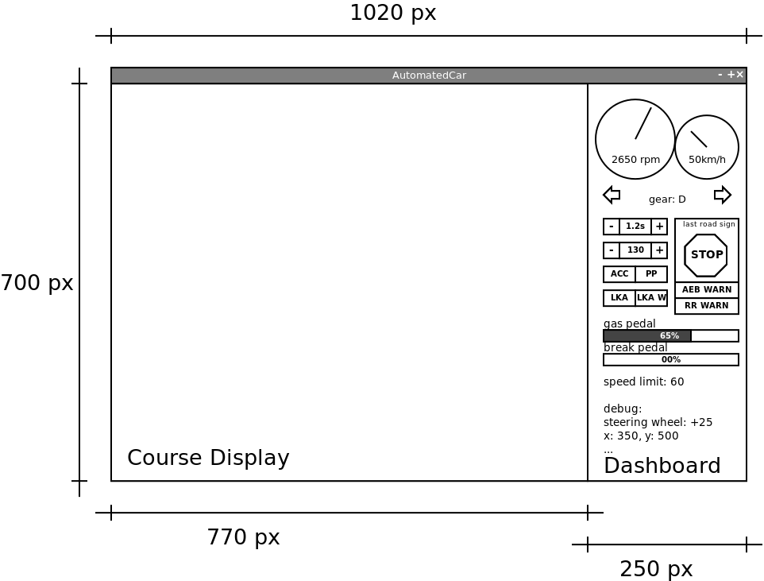

# 1. Világ(modell) kialakítása

* Input: virtuális világot leíró JSON állomány(ok)
* Output: Modellezett világ: mozgó/álló, áthajtható, ütközhető, tömeggel, mérettel rendelkező objektumok, koordináta-rendszerben, olyan interfészek (API) kialakítása, amely biztosítja a későbbiekben többi csapat számára a világmodellhoz való legkézenfekvőbb hozzáférést a későbbi sprintek feladatit is figyelembe véve
* Challenge: „mindenki erre vár”, az interfésznek mielőbb stabilnak kell lennie, akkor is, ha az implementáció még nincs meg, prioritások és „nyomás” kezelése, a megjelenítésért felelős csapat számára a lehető leggyorsabban kód szinten biztosítani a kirajzolandó objektumok alap tulajdonságait.

## Definition of Done

- Útelemeket, fákat, táblákat egyéb statikus objektumokat líró állomány feldolgozása
- Hierarchikus objektummodell implementálása világ leírására, API biztosítása ennek elérésére
- Objektumok kiterjedését biztosító poligonok definiálása
    - ez nem azonos a kép széleivel
- Minden feldolgozott objektum rendelkezzen pozíció, referencia, orientáció, típusadatokkal
- Heterogén kollekció lehetőségének biztosítása
- A modell legyen felkészítve az input fájlból kiolvasott „statikus” objektumokon túl mozgó („dinamikus”) objektumok kezelésére is
    - vezérelt autó, NPC (non-player-character) autó, gyalogos
- A modell tegyen különbséget azon objektumok között amelyeknek egy jármű nekimehet és amelyeknek nem (fa vs. útelem)
- A modell zeljen „z-index”-et, hogy a kizajzolás során biztosítható legyen, hogy mely elemet kell előtt kirajzolni a „kitakatások” végett

## Megjegyzések

* Mielőbb el kell dönteni, hogy milyen koordinátarendszerben dolgozik majd a modell
    * A döntést a megjelenítésért felelős csapattal **együtt** kell meghozni!
* Teljesen járható út, hogy a modell, az input állományban található koordináta-rendszer egy az egyeben alkalmazásra kerül, ebből adódóan minden számolás abban történik, csak a megjelenítés transzformálja át.
* A fa esetében csupán a törzsének lehet nekimenni, nem a lombkoronának, ezért a modellt eképpen kell megalkotni! A törzsnek használható egy szabályos hasáb az egyszerűség kedvéért.
    * 
* Az autó is egyszerűsíthető, nem kell a grafikai elemet teljes mértékben követni.
    * 
* A kanyarodó útelemeknél is lehet egyszerűsítést használni.
    * 

# 2. Vizualizáció

* Input: Objektummodell (modellezett világ), pontosabban annak elégséges metszete. A rajzoláshoz elegendőek az világot leíró állományban megtalálható adatok, nem kell megvárni a teljes modell elkészültét
* Output: Illeszkedő, résmentes megjelenítése, 24 FPS-el frissülő, folyamatos mozgás
* Challenge: Az objektumtranszformációk megfelelő végrehajtása, az objektummodellért felelős csapattal egyeztetés az objektumok elérését illetően

## Definition of Done

- A kirajzolt világ egy része látható csak állandóan a programablakban, a „kamera” a vezérelt autót (egocar) követi
    - világ széleinek kezelése
- statikus objektumok pozícióhelyes kirajzolása és illesztése a rendelkezésre álló építőelemekből
- mozgó objektumok helyes kirajzolása
- debug célból meg kell tudni jeleníteni az egyes objektumokhoz definiált poligonokat
- interfészt kell biztosítani, hogy egy megcínzett objektum poligonja eltérő színnel jelenhessen meg (ha kijelölésre kerül)
- interfészt kell biztosítani a szenzorok látóterét jelképező háromszögek oprionális megjelenítésére
- a megjelenés villódzsásmentes és folyamatos legyen

## Megjegyzések

* A programablaknak az alábbi módon nézni majd ki. A kezdeti kód ezt a felosztást már támogatja, tartalmaz két JPanel-t, ebből a `CourseDisplay`re kell a világ objektumait kirajzolni. Pontosabban az a „viewport”, amit a kamera lát, mögötte ott lehet a többi objektum.
    - ha szükséges egyéb panel definiálható, de a műszerfal (dashboard) működését nem lehet megzavarni
    - 
* A kiadott kód csak példa alap GUI készítésére, ha a feladat úgy kívánja átírható, más rajzoló metódusok vagy logika is használható, de figyelni kell arra, hogy ez esetben minden érintett csapat tudjon a módosításokról. _Mindenek előtt a műszerfalért felelős csapat!_
* Az IntelliJ IDEA GUI Designer-e *nem* használható!

# 3. Irányítás (input)

* Input: a billentyűzet
* Output: PRND váltó(fel-le), gáz és fék 0-100 skála, kormányállás tetszőlegesen választott skála index, billentyűleütés alapján

## Definition of Done

- a fék- és gázpedál állapota szabályozható
- fék- és gázpedál valamint a kormány sem binárisan működik, a billentyű nyomva tartás idejétől függ az input intenzitása
- fék- és gázpedál valamint a kormány is fokozatosan áll vissza alaphelyzetbe a billentyű felengedésével
- az automata váltó 4 állapota szabályozható
- ACC: Állítható céltávolság (T jelű gombbal, körkörösen 0.8/1.0/1.2/1.4 másodperc)
- ACC: Állítható célsebesség (+/- gombbal, 30-160, 10-es lépésközzel)
- Lane Keeping bekapcsolás
- Parkig pilot bekapcsolás
- irányjelző (jobb, bal) kapcsolható
- egyszerre több billentyű is használható
    - kanyarod és gázt adni/fékezni minimum kell tudni egyszerre

## Megjegyzések

- az értékeket a buszon kell közölni

# 4. Műszerfal

- Input: az Ego objektum mozgásállapota, hozzá kapcsolódó adatok
- Output: Fordulatszám, sebesség, kormány, gáz, fék, sebességváltó állása, irányjelző visszajelző, kocsi pozíció megjelenítése (x, y koordináta, az autó rajzolását a vizualizáció végzi, ez egy debug funkció)

## Definition of Done

- Megjelenik a fordulatszám mint „analóg óra”
- Megjelenik a sebesség mint „analóg óra”
- Megjelenik a kormányállás
- Megjelenik a gáz, fék állapota (progressbar)
- Megjelenik a sebességváltó állása (szövegesen)
- Irányjelző visszajelző (egy-egy nyíl kirajzolva)
- Kocsi pozíció megjelenítése (x, y koordináta debug céllal, szövegesen)
- Vezetéstámogató funkciók visszajelzései
    - ACC idő és sebesség limit
    - parking pilot és a lane keeping rendszerek állapot visszajelzése
- az utolsó látott tábla megjelenítése
    - interfész biztosítása, az utolsó látott tábla beállítására

## Megjegyzések

- Az utoljára látott táblához szükséges biztosítani egy interfészt, amely segítségével a funkció egyetlen hívással beállíthatja a képet
- A fordulatszám és a sebesség megjelenése „analóg óraként” történjen, de nem szükséges újra feltalálni a kereket.
- A programlaknak az alábbi módon kell kinéznie. A kezdeti kód ezt a felosztást már támogatja, tartalmaz két JPanel-t, ebből a Dashboard-ra kell a visszajelzőket elhelyezni.
    - 
- Az IntelliJ IDEA GUI Designer-e *nem* használható!

# 5. Hajtáslánc

- Input: VFB-ról sebességváltó, gáz- és fékpedál állása (ezeket az input csapat állítja be)
- Output:
    - Sebességváltó állásától függő mozgásállapot (vagy nem-mozgás) megvalósítása (PRND)
    - Gyorsulás/lassulás számítása gáz/fék alapján
    - elmoztulás vektor kiszámolása
- Challenge:
    - kormányzást implementáló csapattal egyeztetés a mozgásvektor befolyásolásáról
    - irányítást implementáló csapattal egyeztetés az inputt értékekről (packet-ekről)

## Definition of Done

- Az autó gázpedál állásától függően gyorsul
- A gyorsulás a „belső fokozatok” szerint kerül meghatározásra
- Az autó a gázpedál felengedésével fokozatosan lassul, amjd megáll
- Az autó R válóállásban tolat
- Felkészíteni a modult, hogy a vészfékező, az adaptív tempomat vagy a parkoló asszisztens is küldhet inputot, melyek magasabb prioritásúak
    - vészfékező értelemszerűen fékezés inputot
    - az adaptív tempomat és a parkoló asszisztens gáz és fék inputot is

## Megjegyzések

- A 3. sprintes beavatkozásokhoz (AAC, AEB, PP) definiálni kell az kommunikációs csomagot
- Valamint figyelni, hogy ha ilyen érkezik a buszon, akkor azt magasabb prioritású inputként elfogadni

# 6. Kormányzás

- Input: HMI-ről kormányállás, Motor csapattól gyorsulás/lassulás
- Output: Teljes mozgásvektor meghatározása, ez alapján az egocar pozíciófrissítése a világban.
- Challenge: egyeztetés a hajtáslánc csapattal a mozgásvektor befolyásolásáról

## Definition of Done

- Buszról érkező kormányállás felhasználása
- Autó kanyarodásának biztosítása valóságos fordulókör szerint
    - ehhez szükséges extra tulajdonágot meghatározása
- Tényleges mozgásvektor meghatározása a motor csapat gyorsulás, lassulás értékének felhasználásával
- A meghatározott mozgásvektor alapján az autó pozíciójának frissítése
    - az AutomatedCar osztály x,y koordinátáinak frissítése
- Tolatás során is valósághű hanyarodás történik
- Felkészíteni a modult, hogy a sávtartó automatika vagy a parkoló asszisztens is küldhet kormányzás inputot

## Megjegyzések

- A 3. sprintes beavatkozásokhoz (LKA, PP) definiálni kell az kommunikációs csomagot
- Valamint figyelni, hogy ha ilyen érkezik a buszon, akkor azt magasabb prioritású inputként elfogadni
