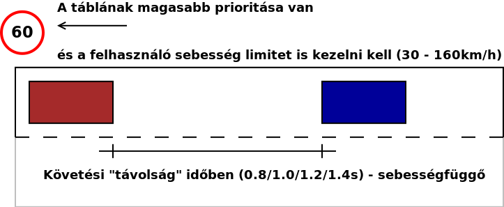
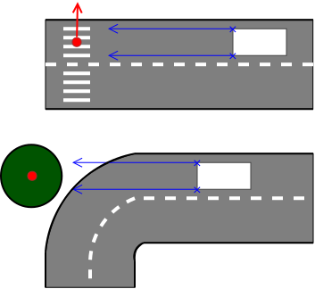
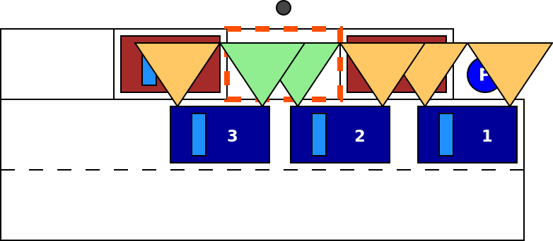
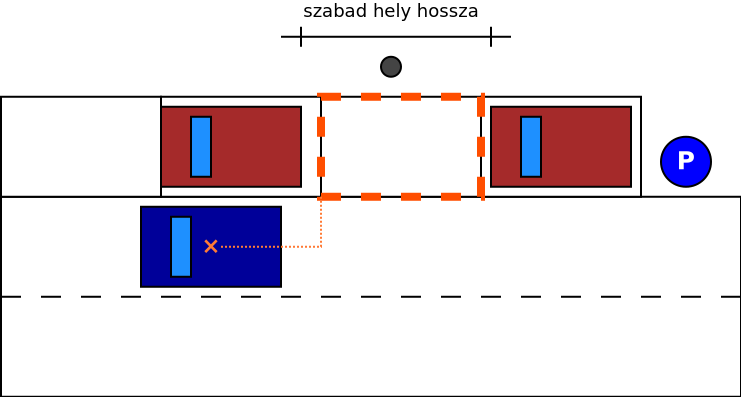
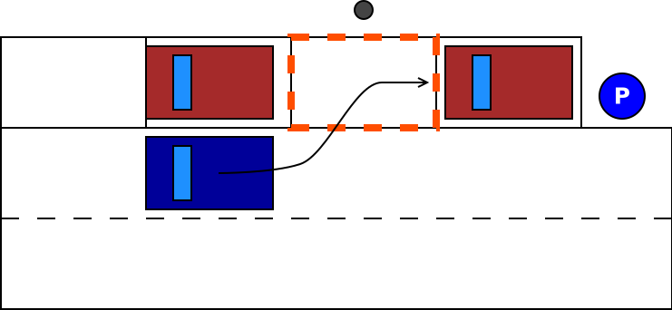
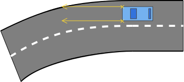
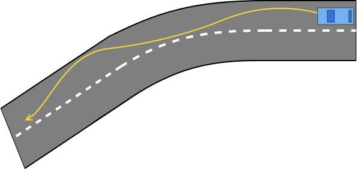
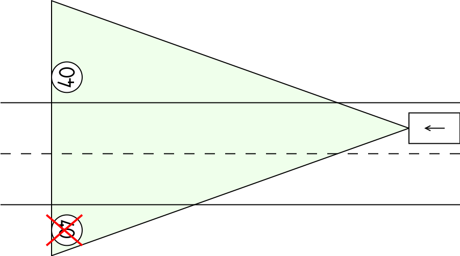
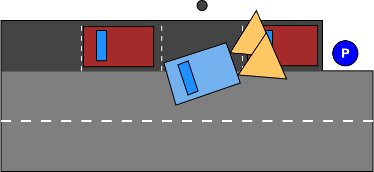

# Vezetéstámogató funkciók

## Adaptív tempomat (Adaptive Cruise Control - ACC)

> Az adaptív sebességtartó automatika a hagyományos tempomat továbbfejlesztett változata. Az ACC egy rendkívül precíz radarral, valamint a gázadás és a fékezés elektronikus vezérlésével tartja az előre beállított követési távolságot. Ha a két jármű között csökken a távolság, az ACC mérsékli a sebességet, sőt szükség esetén fékez is, közben pedig aktiválja a féklámpákat. Ha az elöl haladó jármű gyorsít, vagy átsorol a másik sávba, az Ön autója is fokozatosan felgyorsít, amíg el nem éri az előre beállított sebességet. Az adaptív sebességtartó automatikával a kívánt követési távolságot is beállíthatja (hosszú, közepes vagy rövid).
>
> forrás: [toyota.hu / Adaptív sebességtartó automatika](https://www.toyota.hu/world-of-toyota/safety/adaptive-cruise-control-how-it-works.json)

### Bemutatóvideó (YouTube)

### Implementálás

A kiválasztott célobjektum (autó előtt haladó NPC) sebességéhez igazítja a saját sebességet, vagy tartja a sofőr által kiválasztott sebességhatárt, ha nincs előtte célobjektum.

- ki- és bekapcsolható, reagál az állapotváltás, alapértelmezetten az aktuális sebesség, de min célsebesség 30 km/h
- ha nincs saját sávban autó, a játékos autó tartja a kiválasztott célsebességet
- ha saját sávban található autó:
    - felveszi a sebességét, ha lassabb
    - tartja a kiválasztott sebességet, ha gyorsabb
- fékezésre kikapcsol
- AEB beavatkozásra kikapcsol
- ha speed limitet talál a buszon (táblafelismerő), azt alkalmazza új célsebességként, amíg a sofőr felül nem írja

### Kezelőszervek

- bekapcsoló gomb
- célsebesség kijelölése
    - léptetés 10 km/h-val
    - 30 és 160 km/h között
- követési távolság definiálása másodpercben: 0.8, 1.0, 1.2, 1.4
    - sebességfüggő
    - a léptetés körbe jár, tehát 1.4 után 0.8 következik és a 0.8 után az 1.4

## Autonóm vészfékező rendszer (Automatic Emergency Brake - AEB)

> Az Autonóm Vészfékező Rendszer (AEB) lényege, hogy egy beépített technológia alkalmazásával (általában radar, kamera, vagy lézer segítségével) folyamatosan méri az elöl haladó jármű mögötti távolságot. Ha a rendszer úgy érzi, hogy a gépkocsik közötti távolság veszélyesen csökken, akkor jelzést ad a járművezetőnek, lehetőséget adva a beavatkozásra (pl. fékezésre). Amennyiben a járművezető reakciója elmarad, vagy annak mértékét a rendszer nem tartja elégségesnek, abban az esetben az AEB beavatkozik, s akár vészfékezés alkalmazásával igyekszik a balesetet elkerülni.
>
> forrás: [baleset-megelozes.eu / Autonóm Vészfékező Rendszer (AEB)](http://www.baleset-megelozes.eu/cikk.php?id=1032)

### Bemutatóvideó (YouTube)

### Implementálás

Nyilvánvalóan nem azt kell vizsgálni, hogy az autó ütközik-e az előtte levő objektummal hanem, hogy _ütközni fog-e vele_. A vészfékezés maximális lassulása 9 m/s^2 lehet. Ha az autó 36 m/s sebességgel halad akkor 4 másodperc kell a nullára fékezéshez (ha 50 km/h sebességgel halad, akkor 20). Az aktuális sebességből meghatározható, hogy mekkora a fékút, a maximális megengedett lassulás mellett. Az is kiszámolható, hogy ez mennyi időt vesz igénybe, így az is, hogy mikor kell elkezdeni a vészfékezést, hogy a gyalogost ne üssük el.

A radar szenzor elég messzire ellát, egy nem mozgó objektum (pl. fa) esetében egyszerű meghatározni, hogy lesz-e ütközés és el kell-e kezdeni vészfékezni. Mozgó objektum (gyalogos) esetében azt is figyelembe kell venni, hogy mire odaérünk még az úton lesz-e.

- elkerülhető ütközés esetén vizuális figyelmeztetés a sofőrnek
- 70 km/h felett figyelmeztetés, hogy az AEB nem tud minden helyzetet kezelni
- ha a sofőr nem avatkozik közbe, automatikus fékezés (az utolsó pillanatban, ahol az ütközés még elkerülhető)
- az automatikus fékezés mértéke a sebességgel arányos, de nem lehet 9 m/s^2-nél nagyobb
- gyalogos, fa esetén megáll az autó
- nincs nem releváns objektumokra való fékezés (fals pozitív) - pl. szembejövő autó

## Parkoló asszisztens (Parking Pilot - PP)

A rendszert az erre szolgáló vezérlővel aktiválni kell, majd az irányjelzővel kijelölni, hogy jobbra, vagy balra keressük a parkolóhelyet. Ezután ahogy az autó _vezetői irányítás mellett_ végiggurul a parkoló mellett, a rendszer detektálja az üres parkolóhelyet. Ekkor hátramenetbe kapcsolva az PP vezetői beavatkozás nélkül beáll a szabad pozícióba.

### Bemutatóvideók (YouTube)

- 
- 

### Implementálás

- a parkolás megkezdése külön inputhoz kötött
- a kormány és gáz/fék vezérlésével beparkolás a talált helyre
    - a tolatási manőver lehet egy előre definiált szekvencia, amelyet a parkolóhely (abszolút) pozíciójával lehet paraméterezni
- ha a PP aktív és a váltó hátramenetben van (és van detektált parkolóhely), akkor parkolási szekvencia végrehajtása
- a párhuzamos parkolás akkor sikeres, ha ütközés nélkül megtörténik
- a sofőr beavatkozására (fék, gáz, kormány) kikapcsolás (megszűnik az automata vezérlés)

1. parkolóhely keresése
    - 
    - Az üres hely detektálása lényegébe egy állapotátmenet az első és a hátsó ultrahang szenzor „van-e akadály” visszajelzésében. Amíg egy kocsisor mellett halad az autó mindkét szenzor „van akadály” jelzéssel tér vissza (ez valójában nem `boolean` állapot, egy objektum listát ad vissza), az üres hely kezdetén a az első „nincs akadály” állapotba megy át (a lista üres), majd ahogy az autó halad tovább a hátsó szenzor is „nincs akadály” állapotba kerül.
    - A szabad terület végén ugyanez fordítva játszódik le.
    - Azonban a parkoló autó objektumot adja vissza a szenzor,a melynek ismert a kiterjedése és a referencia pontja, így a játékszoftverben pontosan „látszik” a foglalt terület. Ahogy az egocar elhalad a parkoló autók mellett mindkét autó által lefoglalt terület pontosan ismert így kiszámítható a közöttük meglevő szabad terület.
2. Parkolóhely azonosítva
    - 
    - Miután sikerült meghatározni a szabad parkolóhely méretét, ezt valamiylen formában le kell írni. Célszerűen az egocar referenciapontjáthoz viszonyítva, hogy milyen távol vagyunk tőle, valamint a méretét/hosszát. Lehet egy téglalappal is reprezentálni ahogy az ábrán is látszik.
3. Automatikus parkolás
    - 
    - A parkolási manőver tökéletes megoldása, hogy a _Parking Pilot_ az autó kezelőszerveire hat. Eltekeri a kormányt, gázt ad, fékez, nem csak úgy módosítgatja az autó koordinátáit és elforgatását. (Mindez precízen szabályozható hajtáslánc és kormánymechanika implementációt igényel.)

***

Parkolás manőver leírása nagy vonalakban [forrás](https://www.dmv.ca.gov/portal/dmv/detail/pubs/hdbk/parking):

1. Bring your car to a stop alongside the car at the front of the space.
    - 
2. Reverse into the space with an S motion.
    - 
3. Once the car is parallel with the curb, pull forward to center your car within the space.
    - 

### Kezelőszervek

- aktiválás billentyűzettel
- az irányjelzővel jelölhető ki keresési oldal

## Sávtartó automatika (Lane Keeping Assistant - LKA)

### Bemutatóvideó (YouTube)

### Implementálás

Két jellemző megvalósítása van. Az egyik a sáv széleihez viszonyítva korrigál: ha az autó elérné a sáv szélét, akkor ellenkormányoz. A másik megoldás kiszámolja a sáv közepét és azon tartja az autót.

- 45 foknál enyhébb kanyarodású úton a kocsi a sáv szemmel látható közepén marad
- ha el kell engednie a kontrollt (az automatika számára kezelhetetlen forgalmi szituáció következik, pl. éles kanyar, kereszteződés), vizuális figyelmeztetést ad
Ha újra elérhető a funkció (pl. elhagytuk a kanyart) vizuális indikáció (a műszerfalon)
Be- és kikapcsolható

#### 1. Sáv széleinek használata

#### 2. Sávközép használata

Sávon belüli mozgás: a LKA működése egy enyhe sávon belüli cikázást eredményez.

### Kezelőszervek

- aktiválás a műszerfalról (vagy billentyűzettel)

## Táblafelismerő (Traffic Sign Recognition - TSR)

A kamera látóterébe eső és az autó számára releváns (ellentétes irányba közlekedők számára szólóakat nem) közlekedési táblákat fel kell ismerni és a legutolsó relevánsat megjeleníteni a műszerfalon. Ha ez sebességkorlátozás, akkor azt a buszra kiírni (az ACC használja).

### Bemutatóvideó (YouTube)

### Implementálás

- a táblát addig kell megjeleníteni, amíg újabb nem talál a rendszer
- a sebesség limit mindaddig érvényes, míg feloldásra vagy felülbírálásra nem kerül
- nem releváns táblák nem kerülhetnek azonosításra
    - mindenek előtt az út bal oldalán levők
- a kamera látótere elég nagy, a kanyaroknál kialakuló helyzetet is kezelni kell

## Tolatóradar

A hátsó ultrahang szenzorokat használja akadály detektálásra. Kiszámolja az akadály távolságát és annak megfelelően figyelmeztető jelzést ad a vezetőnek, megkönnyítve a manuális parkolást, tolatást.

### Bemutatóvideó (YouTube)

### Implementálás

- csak hátramenetben aktív
- figyelmeztetés megjelenítése a műszerfalon
- távolság megjelenítése a műszerfalon
- a buszon keresztül történik a modulok (tolatóradar és műszerfal) kommunikáció
- a kijelzés 3 fokozatban történik
    - nincs akadály
    - közel van akadály (0.8m-en belül)
    - nagyon közel van akadály (0.4m-en belül)

<!--
# „Fun” kategória

* [Hyundai - The Empty Car Convoy](https://www.youtube.com/watch?v=Xbjdmw8D9-Y)
    - LKA, ACC and AEB marketing
* [Nissan Parking Pilot inspirálta helyére ”parkoló” papucsa](https://youtu.be/tazFfEP_NcY) -->
