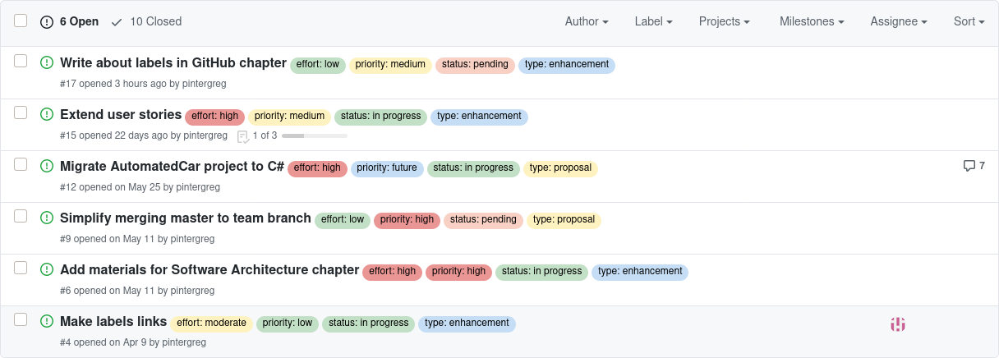
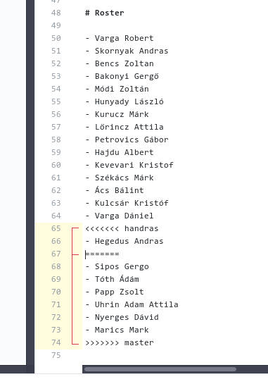
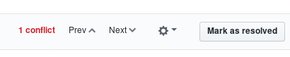
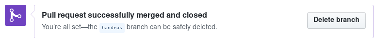

# GitHub

A félév során a GitHubot használjuk a kód tárolására, a feladatok menedzselésére is és kommunikációra is.

## Oktatóanyagok

- [**interaktív oktatófelület**](https://lab.github.com/)
- [GitHub Guides](https://guides.github.com/)

## Áttekintés

Minden hallgató tagja lesz egy GitHub szervezetnek (`Organization`), és egy-egy csapatnak (Team A\[1-4\], Team B\[1-4\]). Minden csapat külön issue board-dal rendelkezik (`Projects`), ezen kell vezetni a feladatok (`issue`) megoldását (részletében lásd [Munkafolyamat](workflow.md)).

Issue-t nem csak feladatra lehet felvenni, akár kérdésre is (felénk vagy más csapatok felé is), probléma megvitatására is. Ez esetben célszerű megjelölni a `type: question` címkével. 2017 őszétől csapat (`team`) szintű fórummal (`Discussions`) is rendelkezik a GitHub. A szervezeten belül a csapatok hierarchikus struktúrában vannak. A gyökér az _Everyone_, az összes többi csapat ennek tagja (Group A, Group B csapatokon keresztül). Az Everyone falára írt üzeneteket mindenki megkapja. Ezen keresztül fogunk a félév során kurzus szintű közleményeket kiadni, de bárki használhatja kommunikációra. Ugyanilyen üzenőfallal rendelkezik az összes többi csapat is, amelyre szintén bárki írhat. Ha például a Team2-ből szeretné elérni valaki a Team3-at, akkor mindösszesen annyi a dolga, hogy ír a Team3 üzenőfalára. Az _Instructors_ nevű team-en keresztül az oktatókat lehet elérni ugyanilyen módon.

A comment szekciókban is élnek az @ jeles említések, ez a mi esetünkben `@ravaszla` és `@pintergreg`, ugyanígy működik csapatra is pl. `@szfmv2020-osz/team-a1`, illetve `@szfmv2020-osz/instructors ` a mi esetünkben. Csapat esetében a csapat valamennyi tagja kap értesítést az hivatkozásról.

A GitHub valamennyi elemén használhatóak formázási lehetőségek [Markdown stílusban](https://guides.github.com/features/mastering-markdown/), kód kiemelésre is lehetőség van, amelyet több mint célszerű használni. Ehhez csak a nyelv nevét kell csak a nyitó ``` jelek után írni:

<pre>
```python
def get_random_number():
    return 4;  # chosen by fair dice roll. guaranteed to be random.
```
</pre>

Eredmény:

```python
def get_random_number():
    return 4;  # chosen by fair dice roll. guaranteed to be random.
```

## Címkék

Létrehozásra kerültek címkék (`Labels`) négy „dimenzióban” (vagy kategóriában), amelyek használata elvárás a létrehozott issue-khoz a munka áttekinthetőségének javítása miatt. Kell, hogy legyen az issue-nak típusa, állapota, prioritása és legyen megjelölve a feladat nehézsége is.



### Típus (type)

- bug
- design
- documentation
- enhancement
- integration
- question
- user story

### Állapot (status)

- completed
- duplicate
- help wanted
- invalid
- pending
- review needed

### Prioritás (priority)

- critical
- high
- moderate
- low

### Nehézség (effort)

- high
- moderate
- low

<!--
## Pull requestek kezelése:  review és ütközésfeloldás

Előfordulhat, hogy a git nem tudja feloldani a változtatásokat és emberi beavatkozást igényel a merge-elés. Például létrehoztad a feature branchet a csapat branch adott állapotáról, ám az időközben módosult és a módosítás ugyanazon fájl ugyanazon részét érintette. A GitHubon ez az alábbihoz hasonlóan néz ki:


Ezen belül is egyszerűbb esetekben a GH felajánlja a webes szerkesztőjét, de összetettebb esetekben ki kell checkolni az adott ágat és „kézzel” (editorral) feloldani helyzetet.

**Fontos!** A masterbe nem fogadunk el olyan PR-et, amelyben ütközés van, mivel jellemzően nem tudjuk eldönteni, hogy melyik változat fele meg „az utoljára megbeszélteknek”.

### Webes szerkesztő

A képen az  látható, hogy Hegedűs kolléga a `master` azon állapotában írta be a nevét, amikor a 64. sor volt az utolsó. Időközben egyéb PR-eket is elfogadtam így a git nem tudja, hogy a 68-73. sorokat kell megtartani vagy a 66.-at (ennek szintaktikáját látni a „kacsacsőrökkel”).



 Jelen esetben persze mindkettő kell, így kézzel átrendezem, majd ezt megjelölöm feloldottnak:




**További tippek a témában**: https://stackoverflow.com/questions/161813/how-to-resolve-merge-conflicts-in-git

Ekkor a GH azt mutatja, hogy nincs ütközés, de review szükséges (ha nem is volt ütközés, akkor innen indul a történet).

### Lokális szerkesztő

Ha a GH webes felületén nem engedi az ütközés feloldását, akkor lokálisan kell. Az IDEA pl. az alábbi három paneles megoldást kínálja. Csak rá kell kattintgatni arra, amelyiket meg akarjuk tartani (vagy kézzel összemásolni mint a fönti példa esetében).

Ha valaki parancssorból intézi, akkor a beállított editorral nyitja meg (vi, nano, stb.) és szintaktikailag ugyanazt a megoldást kapja mint a webes editor esetében.


-->

## Branching modell

Csoportos munka során fontos tisztázandó kérdés, hogy milyen stratégiával kezeljük a branch-eket. Az egyik legismertebb talán a GitFlow ([A successful Git branching model](http://nvie.com/posts/a-successful-git-branching-model/)), amelyet mára több kritika is ért.

A legelterjedtebbek tőbb tulajdonságait Scott Shipp [War of the Git Flows](https://dev.to/scottshipp/war-of-the-git-flows-3ec2) című cikke nyomán a következő táblázatban foglaltam össze:

|                       | GitFlow                | GitHub Flow | OneFlow   | GitLab Flow | Trunk-Based Development    | Rebasing Flow |
| --------------------- | ---------------------- | ----------- | --------- | ----------- | -------------------------- | ------------- |
| Uses feature branches | yes                    | yes         | yes       | yes         | optionally, if short lived | no            |
| Uses release branches | yes                    | no          | yes       | yes         | yes                        | optional      |
| Uses rebasing         | no                     | no          | optional  | optional    | optional                   | yes           |
| Merges                | no fast forward merges | unclear     | up to you | up to you   | optional                   | no            |

- [A successful Git branching model](http://nvie.com/posts/a-successful-git-branching-model/)
- [A succesful Git branching model considered harmful](https://barro.github.io/2016/02/a-succesful-git-branching-model-considered-harmful/)
- [Trunk-Based Development](https://trunkbaseddevelopment.com/)
- [GitHubFlow](https://guides.github.com/introduction/flow/)
- [GitLabFlow](https://docs.gitlab.com/ee/topics/gitlab_flow.html)
- [OneFlow](https://www.endoflineblog.com/oneflow-a-git-branching-model-and-workflow#oneflow-advantages)
- [a simple git branching model](https://gist.github.com/jbenet/ee6c9ac48068889b0912)
- [Comparing Workflows](https://www.atlassian.com/git/tutorials/comparing-workflows)

A korábbi félévekben a GitFlow szerű megoldást használtuk megbonyolítva azzal, hogy minden csapatnak saját fejlesztői branche-e volt. Ezt jelentősen leegyszerűsítendő a [GitHubFlow](https://guides.github.com/introduction/flow/)-ra váltunk.

A `master` branch [védett](https://docs.github.com/en/github/administering-a-repository/about-protected-branches), nem lehet bele commitolni. Minden feladatohoz tartoznia kell egy issue-nak, és a megoldásához létre kell hozni egy (feature) branchet az aktuális masterről. A feladatot azon kell megoldani, majd PR-et nyitni a masterbe.

Ahhoz, hogy a masterbe kerülhessen a módosítás több követelménynek is teljesülnie kell:

- a kód fordul
- az összes teszt sikeres
- két csapattárs és egy oktató jóvá hagyta (review)
- nincs ütközés (conflict)

<!--  -->

<!-- A `master` branch védett, nem lehet bele commitolni. Nem egy, hanem több (4) fejlesztői branch-ünk van (`team1`, ..., `team4`), ezek szintén védettek. Minden feladathoz létre kell hozni egy *feature branch-et*, azon lehet dolgozni. Ha a feladat elkészült, akkor a csapat branchbe lehet *merge-eni*. Ami mivel védett [*pull request-et*](https://help.github.com/articles/about-pull-requests/) (továbbiakban PR) küldeni. A PR lehetőséget biztosít ellenőrzésekre és [review-zásra](https://help.github.com/articles/about-pull-request-reviews/). Csak a lefordítható, teszteknek megfelelő, ütközés (conflict) mentes PR kerülhet elfogadásra! -->

**Fontos**: Ha egy Pull Request _nem_ fogadható el, akkor sem kell a PR-t lezárni, lehet tovább dolgozni a forrás branchen, az új commit-okkal automatikusan frissül a PR is addig míg a teszteknek meg nem felel és elfogadásra nem került. Sőt, kifejezetten lehet [**Draft\* Pull Request**](https://github.blog/2019-02-14-introducing-draft-pull-requests/) is létrehozni, jelezve, hogy a munka már tartalmaz véleményezhető elemeket, de még nincs kész.

Ha a PR el lett fogadva<!--, a feature branch-re nincs már tovább szükség. Le lehet törölni és--> be kell zárni azt az _issue-t_ is, amihez a branch kapcsolódott. Tehát ideálisan minden (nem user-story és kérdés) issue-hoz készül(t) egy branch.

### Forking

A tárgyhoz nem lesz szükség forkok használatára, de a GitHub workflow szerves részét képezi (különösen nyílt forrású projekteknél) így érdemes lehet ismerni.

- [The Definitive Guide to Forks and Branches in Git](https://www.pluralsight.com/blog/software-development/the-definitive-guide-to-forks-and-branches-in-git)
- [Git branching and forking in the enterprise: why fork?](https://www.atlassian.com/blog/git/git-branching-and-forking-in-the-enterprise-why-fork)
- [Using the Fork-and-Branch Git Workflow](https://blog.scottlowe.org/2015/01/27/using-fork-branch-git-workflow/)
- [Stackoverflow / Forking vs. Branching in GitHub](https://stackoverflow.com/a/34343080/4737417)

## Review


Erre az „add your review” szolgál. Fájlonként át lehet nézni minden módosítást, soronként kommentelni, illetve egy globális véleményt írni a PR-ről (+1, -1, -2). A comment opció semleges, nem elfogadás, de nem is elutasítás. A másik két opció elég egyértelmű. Ha változtatást kérsz, akkor addig amíg a PR forrásbranche nem módosul nem lehet újra próbálkozni a PR elfogadásával.


Ha minden rendben, akkor el lehet fogadni a PR-et:


Elfogadás után így néz ki:



<!--
Ezen a ponton a feature branch nem szükséges továbbá, törölhető. Persze egy ideig még visszaállítható:


-->

## Társszerzők

A munkafolyamat alapvetően egyéni munkára van kitalálva, de legkevésbé sem tilos a [pair programming](https://en.wikipedia.org/wiki/Pair_programming) sem. Volt, hogy Skype-os képernyő-megosztásos módszerrel dolgoztak _távolról_ párban... Ilyenkor mindig felvetődik a kérdés, hogy csak az egyik kolléga nevében történhet a commit de mi van a másikkal... A GitHub-nak [van egy funkciója](https://github.com/blog/2496-commit-together-with-co-authors) ennek orvoslására. Részletek [elérhetőek itt](https://help.github.com/articles/creating-a-commit-with-multiple-authors/).

Ebben az esetben a commit üzenet törzse után 2 üres sorral elválasztva kell a társszerzőket feltüntetni. Pl.:

```
Commit message header

Commit message body preceded by an empty line and followed by
two empty lines and the trailer.


Co-authored-by: name <name@example.com>
Co-authored-by: another-name <another-name@example.com>"
```

Ahhoz, hogy a GitHub a társszerzőt össze is tudja rendelni a felhasználói fiókjával fontos, hogy az a `name` és különösen az az `e-mail` szerepeljen, amelyet egyébként git beállításként használ!

### E-mail cím védelme

A GH minden felhasználónak biztosít egy "proxy ímélcímet", hogy titokban tarthassa a címét, ez xxxxxxx+username@users.noreply.github.com szerkezetű, ahogy xxxxxxx egy hétjegyű felhasználói azonosító. Bővebben [itt](https://docs.github.com/en/github/setting-up-and-managing-your-github-user-account/setting-your-commit-email-address#about-commit-email-addresses). Ezt is lehet használni, nem csak társszerzőhöz hanem saját címnek is, csak legyen konzisztens!
