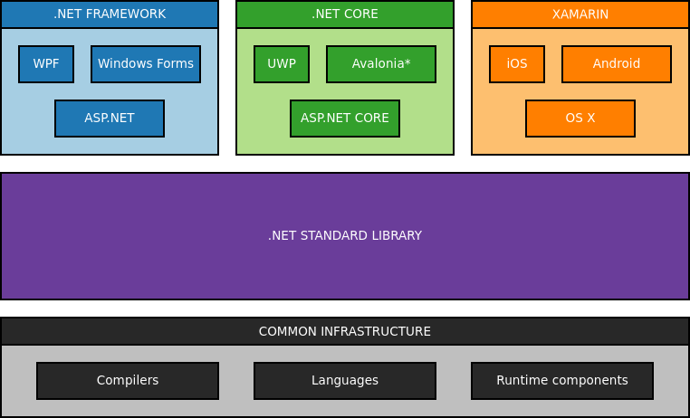

# Implementáció

<!-- toc -->

## C#

A korábbi félévek visszajelzései visszatérő eleme volt, hogy C#-ban is meg lehessen oldani a feladatot. A cross-plastform fejlesztés ugyanúgy feltétel, így „csak” a [.NET Core](https://dotnet.microsoft.com/download/dotnet-core) jöhet szóba, ennek is a 3.1-es verziója (LTS).

A .NET 5 egyesíti majd a .NET Framework-öt és a .NET Core-t, majd a .NET 6 be fogja vezetni a MAUI-t mint multiplatform keretrendszert grafikus felületek készítéséhez, ez azonban ma még [nem elérhető](https://devblogs.microsoft.com/dotnet/introducing-net-multi-platform-app-ui/).

Mivel a CI környezet Linux alapon futott, szükség volt egy áthidaló megoldásra miután a WPF nem használható Windows-on kívül, erre a _3rd party_ [Avalonia](http://avaloniaui.net/) keretrendszert használtuk. Az Avalonia a WPF-hez hasonlóan egy XAML alapú Model-View-ViewModel (MVVM) rendszer.
Viszont miután már a GitHub Actions ingyenes opció mellett is lehetővé teszi a Windows alapú CI környezetek használatát, a WPF is használható lett.

Használható fejlesztői környezetek: Visual Studio, VS Code (kizárólag a hivatalos, MS változattal működik együtt a .NET debugger), IntelliJ Rider, stb.

Hasznos írások az implementációhoz:

- Útvonalkövetés: [A* algoritmus](https://en.wikipedia.org/wiki/A*_search_algorithm)
    - implementáció: LINQ to A* [GitHub](https://github.com/rvhuang/linq-to-astar), [NuGet](https://www.nuget.org/packages/linq-to-astar/)

## Java

A feladat megoldásához Java nyelvet, annak is a 11-es verzióját kell használni (LTS), [Maven](https://maven.apache.org/guides/getting-started/index.html) projekt menedzsment eszközzel. (A kiinduló projekt ezeket már teljesíti). Egyaránt használható az [Oracle JDK 11](https://www.oracle.com/technetwork/java/javase/downloads/jdk11-downloads-5066655.html) vagy az [OpenJDK 11](http://openjdk.java.net/projects/jdk/11/) is, operációs rendszer sincs megszabva.
Az automatizált CI eszközök jogi okokból az OpenJDK-t használják, linuxon. Szóval már csak emiatt is „érdemes” platformfüggetlen kódot írni!

A kiadott kód csak példa egy alap GUI készítésére Swing-el, ez akár teljesen átírható, más GUI könyvtárak (pl. JavaFx) is használható.
Viszont az IntelliJ IDEA GUI Designer-e *nem* használható, esetleges kompatiblitási okoból.

Hasznos írások az implementációhoz:

- [Billentyű/input kezelés](https://gamedev.stackexchange.com/questions/56017/java-best-implementation-keylistener-for-games)
- [Időzítés](https://web.archive.org/web/20190403012130/https://gafferongames.com/post/fix_your_timestep/)
- [Villódzásmentes rajzolás](https://docs.oracle.com/javase/tutorial/extra/fullscreen/doublebuf.html)
