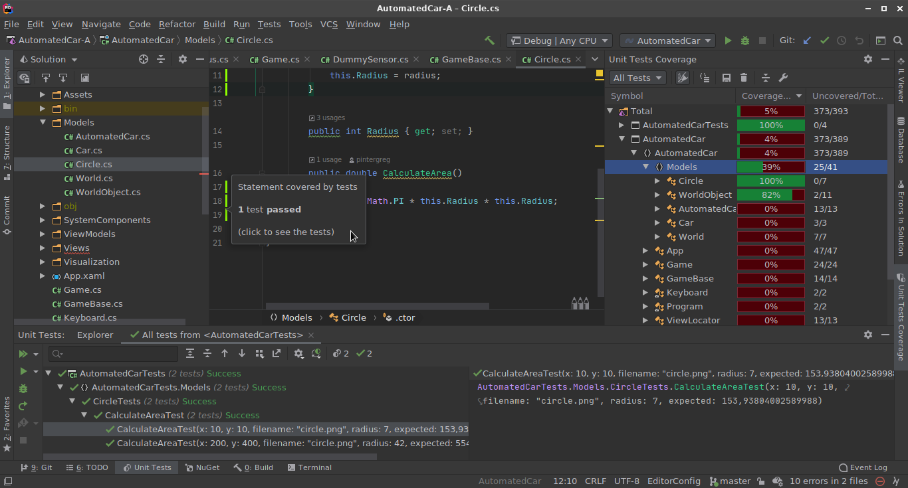

# IntelliJ Rider - C#

Egyetemi e-mail címmel (`stud.uni-obuda.hu`) igényelhető egy éves hallgatói licenc az IntelliJ termékekhez, így használható a C# fejlesztéshez szánt [Rider](https://www.jetbrains.com/rider/) is.

## Code Style

https://www.nuget.org/packages/StyleCop.Analyzers/

## Save Actions Reborn

Ezzel automatizálni lehet a Reformat Code meghívásást.

## Code Coverage

- [dotCover](https://www.jetbrains.com/dotcover/)
- része a Ridernek
- aktiválás: Unit Tests fül, Run (zöld háromszög) rejtett menü / Cover Selected Unit Tests

