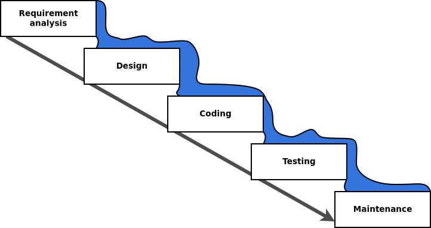
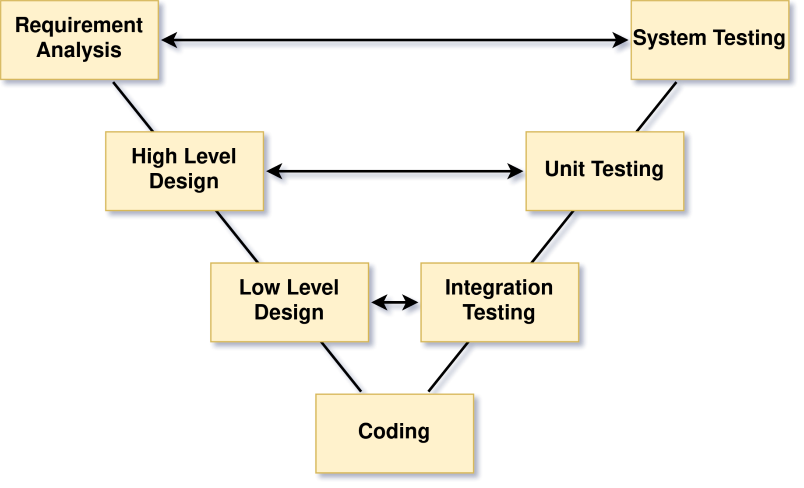

## Waterfall

- Sequential design process
- Next stage can be started after finishing the previous
- After finishing a step, cannot go back to previous

<!-- vertical -->

## Waterfall: pros

- Customer can have clear expectation about the final product
- Employee turnover does not influence project due to strong documentation
- Simple, easy to use model

<!-- vertical -->

## Waterfall: cons

- Customer can have clear expectation about the final product
- Employee turnover does not influence project due to strong documentation
- Simple, easy to use model

<!-- vertical -->
<!-- .slide: data-visibility="hidden" -->

## Waterfall Vs. Agile

- [Waterfall Vs. Agile: Must Know Differences](https://www.guru99.com/waterfall-vs-agile.html)
    - A többi fejezet is ajánlott
- [Waterfall vs. Agile: Which is the Right Development Methodology for Your Project?](https://www.seguetech.com/waterfall-vs-agile-methodology/)

<!-- slide -->

## V-Model

- [V-Model in Software Testing](https://www.guru99.com/v-model-software-testing.html)

<!-- slide -->

## Complex Project

- **Complex projects** are where requirements and technology are not agreed.
- Flexibility and frequent feedback loops are needed here.

<!-- slide -->

## The Agile Manifesto

<!-- .slide: class="slide-quote" -->

> We are uncovering better ways of developing software by doing it and helping others do it. Through this work we have come to value:
>
> - **Individuals and interactions** over processes and tools
> - **Working software** over comprehensive documentation
> - **Customer collaboration over** contract negotiation
> - **Responding to change over** following a plan
>
> That is, while there is value in the items on the right, we value the items on the left more.
>
> <cite>[forrás](https://www.agilealliance.org/agile101/the-agile-manifesto/)</cite>

<!-- vertical -->
<!-- .slide: data-visibility="hidden" -->

- [The following 12 Principles are based on the Agile Manifesto.](https://www.agilealliance.org/agile101/12-principles-behind-the-agile-manifesto/)
- [Külön érdekes a szoftverfejlesztési metodológiákat metrótérképszerűen összefoglaló ábra](https://www.agilealliance.org/agile101/subway-map-to-agile-practices/)

<!-- vertical -->

## Agile Principles

- Frequent delivery
- Test early, test often
- Small, incremental releases
- Development team makes their own decisions
- Direct communication between customer and development team

<!-- vertical -->

## Best Practices for Agile

- Test-Driven Development (TDD)
- Regular refactoring
- Continuous integration
- Simple design
- Pair programming

<!-- slide -->

## SCRUM

> A framework within which people can address complex adaptive problems, while productively and creatively delivering products of the highest possible value.

- Not a process or technique, rather a framework
- Based on empirical process theory
- Empiricism assumes that knowledge comes from experience
- Iterative, incremental approach
- Consists of
    - Scrum Team/Roles
    - Events
    - Artifacts
    - Rules

<!-- -->
- [The Scrum Guide (PDF, 17 pages)](https://www.scrumguides.org/docs/scrumguide/v2016/2016-Scrum-Guide-US.pdf)
- [Scrum in practice: the daily Scrum](https://manifesto.co.uk/scrum-practice-daily-scrum/)

<!-- slide -->

## Scrum Team & Roles

- Self-organizing
- Cross-functional
- Maximizes opportunities for feedback

<!-- -->

- Roles:
    - Product Owner (PO)
    - Development Team
    - Scrum Master
- [Further reading](https://www.scrumhub.com/scrum-guide/team-roles/)

<!-- vertical -->

## Product Owner

- Responsible for optimizing the value of the work the Development Team does
- Clarifies product backlog items
- Product backlog items can only be prioritized by PO
- Decisions made by PO is respected by everyone in the entire organization

<!-- vertical -->
<!-- .slide: data-visibility="hidden" -->

- [The Agile Product Owner Responsibilities](https://www.romanpichler.com/blog/the-product-owner-responsibilities/)

<!-- vertical -->

## Development Team

- Self-organizing team – makes its own decisions how to turn Product Backlog into potentially releasable functionalities
- Cross-functional team – team has all skills needed turn Product Backlog into potentially releasable functionalities
- No titles inside team
- No subteams inside team
- Size can be between 3 and 9

<!-- vertical -->

## Cross-functional team

Akkor tud egy csapat „cross-functional” lenni, ha minden tagja kellőképpen érti a csapat feladatát, így a tagok képesek egymást helyettesíteni. A fenti ábra a csapattagok tudását szemlélteti. Az első esetben csupán elenyésző általános tudással rendelkező emberekről van szó, akik egy nagyon szűk területet ismernek. A *cross-functional team* esetében is megvan az egyes tagok specifikus tudása ám az kevésbé nyúlik túl a csapat általános ismeretein és kevésbé specifikusabb is.

<!-- vertical -->

## Scrum Master

- Responsible for Scrum to be understood in scrum team
- Facilitates scrum events
- Removes impediments from development team
- Coaches development team for self-organization
- Coaches organization in Scrum adaptation
- Not the „boss” of development team
- Servant leader of the team
- Can be one team member or common Scrum Master for several teams

[Scrum Master - Funny movie about The Power of Scrum](https://www.youtube.com/watch?v=P6v-I9VvTq4)

<!-- slide -->

## Scrum Events

- Time boxed events
    - there is a maximal time allowed to keep
- Regular meetings
    - minimizes the need for other not defined meetings

<!-- vertical -->

## Sprint

- Time-boxed for one month or less
- During the sprint a potentially releasable product increment shall be created
- Consists of
    - Sprint Planning
    - Daily Scrums (Standup)
    - Development work
    - Sprint Review
    - Sprint Retrospective
- Each Sprint has a definition what has to be done
- During Sprint no change can be made that influences the Sprint Goal
- Can be terminated when Sprint Goal became obsolete
- [Further reading](https://www.scrumhub.com/scrum-guide/sprints/)

<!-- vertical -->

## Sprint Planning

- The work that should be done in Sprint is planned in Sprint Planning
- Eight hours for a one-month Sprint, for shorter Sprint it is less
- Answers for two questions:
    - What will be delivered for the next Sprint?
    - How it will be done?
- Product Backlog is used as an input, Sprint Backlog (SB) is filled with items from Product Backlog (PB)
- The number of selected items has to be decided only by development team
- Product Owner helps to clarify Product Backlog items
- Scrum Master facilitates the meeting when needed
- [Further reading: Estimations](https://www.scrumhub.com/scrum-guide/estimations/)

<!-- vertical -->

## Daily Scrum

- Time-boxed to 15 minutes
- Main goal is to synchronize activities between team members
- Kept each day at the same time and same place to reduce complexity
- Every team member participates and answers three questions:
    - What was done by himself/herself by last Daily Scrum?
    - What will be done by himself/herself till next Daily Scrum?
    - Are there any impediments that prevent the work?
- Scrum Master does not need to participate always, but
    - Ensures that all team members take part
    - Teaches development team to keep the time-box
- [Further reading](https://www.scrumhub.com/scrum-guide/daily-standups/)

<!-- vertical -->

## Sprint Review

- Kept at the end of the sprint
- Time-boxed to four hour for one month sprint
- Scrum Team and stakeholders attend
- PO explains the PB items, that are „Done” or not „Done” to stakeholders
- Development Team demonstrates the work and answers questions
- Scrum Team gather feedback from stakeholders
- All participants collaborates on what to do next
<!-- -->
- [Further reading: How to Succeed at a Sprint Demo](https://reqtest.com/development/how-to-succeed-at-a-sprint-demo/)

<!-- vertical -->

## Sprint Retrospective

- For the Scrum Team to inspect and improve itself
- Three hour time-box after sprint review for one-month Sprint
- Plan shall be created for implementing improvements of the way of working
- [Further reading](https://www.scrumhub.com/scrum-guide/retrospectives/)

<!-- slide -->

## Sprint Artifacts: Product Backlog

- Ordered list of items needed for the product
- Dynamically evolves
- Property of Product Owner
- PO is responsible for its content and prioritization
- [Further reading](https://www.scrumhub.com/scrum-guide/product-backlog/)

<!-- vertical -->

## Sprint Artifacts: Sprint Backlog

- Selected PB items for a certain Sprint in Sprint Planning
- Development Team is the owner
- Estimates are made by Development Team

<!-- vertical -->

## Sprint Artifacts: Product Increment

- Sum of all PB items completed
- Has to meet the Definition of "Done"
- A new increment is delivered after each Sprint

<!-- vertical -->

## Burndown Chart

- Expresses the remaining effort for a time period
- X axis: time left in the Sprint
- Y axis: remaining effort for the Sprint measured in story points
- Story points measures how "difficult" a user story is
- Story points are estimated by Development Team
- [Further reading](https://www.scrumhub.com/scrum-guide/burndowns/)

<!-- vertical -->
<!-- .slide: data-visibility="hidden" -->

[AgileMe - Sprint Burndown Chart](http://www.agileme.com.au/wiki/Sprint_Burndown_Chart)

<!-- vertical -->

## Artifact Transparency: Definition of Done

- Checklist of activities needed for a product increment
- List of activities such coding, unit testing, documentation, integration test, etc.
- Has to be understood and followed by all team members

<!-- slide -->

## Scaling Scrum: Scrum of Scrums

- Each Scrum Team delegates an "ambassador" who attends the Scrum of Scrums meeting
- Ambassadors coordinate the work of multiple Scrum Teams
- Meetings are not as frequent as Daily Scrum
- [Further reading](https://www.agilealliance.org/glossary/scrum-of-scrums/)

<!-- slide -->

## Kanban

- Pull system
- Eliminate waste
- Decrease cycle time
- Should be applied to current processes
- Rules:
    - Visualize Workflow
    - Limit Work in Process
    - Measure and Improve Flow

<!-- vertical -->

## Kanban cont.

- Tasks move left to right
- Choose the rightest top task to work with
    - to finish it as soon as possible
- within a column, the task at the top has the highest priority
- task may contain
    - assignee
    - effort
    - etc.
- Further reading
    - [Kanban Fundamentals](https://www.scrumhub.com/kanban-fundamentals/)

<!-- vertical -->

## Scrum vs. Kanban

|                     | SCRUM                        | Kanban          |
|---------------------|------------------------------|-----------------|
| Cadence             | Regular fixed length sprints | Continuous flow |
| Release methodology | At the end of each sprint if approved by the product owner | Continuous delivery or at the team's discretion |
| Roles               | Product owner, scrum master, development team | No existing roles. Some teams enlist the help of an agile coach.|
| Change philosophy   | Teams should strive to not make changes to the sprint forecast during the sprint. Doing so compromises learnings around estimation.| Change can happen at any time |

<!-- slide -->
<!-- .slide: data-visibility="hidden" -->

## Scrumban

- [What is Scrumban?](https://www.agilealliance.org/what-is-scrumban/)

<!-- slide -->
<!-- .slide: data-visibility="hidden" -->

## Further reading about SCRUM

<!--  -->

- [Team Roles](https://www.scrumhub.com/scrum-guide/team-roles/)
- [Product Backlog](https://www.scrumhub.com/scrum-guide/product-backlog/)
- [Release Backlog](https://www.scrumhub.com/scrum-guide/release-backlog/)
- [Estimations](https://www.scrumhub.com/scrum-guide/estimations/)
- [Sprints](https://www.scrumhub.com/scrum-guide/sprints/)
- [Burndowns](https://www.scrumhub.com/scrum-guide/burndowns/)
- [Expectation Charts](https://www.scrumhub.com/scrum-guide/expectation-charts/)
- [Daily Standups](https://www.scrumhub.com/scrum-guide/daily-standups/)
- [Retrospectives](https://www.scrumhub.com/scrum-guide/retrospectives/)

<!-- nem működik -->

<!-- ## Az Egyetem más tárgyhoz fejlesztett e-tananyaga SCRUM-hoz

- Elérhető [innen](http://innovacio.uni-obuda.hu/p/elearning/)
- Ebből az első két blokk (a „[Product owner](http://innovacio.uni-obuda.hu/p/elearning/course/77)” és a „[Scrum Master](http://innovacio.uni-obuda.hu/p/elearning/course/89)”) releváns, mindkettő 5-5 modul, modulonként egy ~50 oldalas prezentációval.
- Teljes más a struktúrája mint az SzFMV tárgynak, de kifejezetten hasznos részeket is tartalmaz mint pl. a Product owner / 4. modul: user story szétbontása
- A modulokhoz ellenőrző kérdések is vannak, ezek bár független a ZH kérdéseinkről, de a releváns fejezetek önellenőrzésére jók lehetnek -->

<!--
UNUSED
https://agilepearls.wordpress.com/category/agile-sw-methodology/
-->

<!-- slide -->
<!-- .slide: data-visibility="hidden" -->
## Quiz

<pre>

    ---
    shuffleQuestions: true
    shuffleAnswers: true
    ---

    ### Scrum does not have a role called "project manager".

    1. [x] True
    1. [ ] False

    ### Which statement best describes a Product Owner's responsibility?

    1. [x] Optimizing the value of the work the Development Team does.
    1. [ ] Directing the Development Team.
    1. [ ] Managing the project and ensuring that the work meets the commitments to the stakeholders.
    1. [ ] Keeping stakeholders at bay. 

    ### The Development Team should have all the skills needed to?

    1. [ ] Complete the project as estimated when the date and cost are committed to the Product Owner.
    1. [ ] Do all of the development work, except for specialized testing that requires additional tools and environments.
    1. [x] Turn the Product Backlog items it selects into an increment of potentially releasable product functionality.

    ### What are the two primary ways a Scrum Master keeps a Development Team working at its highest level of productivity?

    - [x] By facilitating Development Team decisions.
    - [x] By removing impediments that hinder the Development Team.
    - [ ] By starting and ending the meetings at the proper time.
    - [ ] By keeping high value features high in the Product Backlog.

    ### What is the main reason for the Scrum Master to be at the Daily Scrum?

    1. [ ] To make sure every team member answers the three questions.
    1. [x] He or she does not have to be there; he or she only has to ensure the Development Team has a Daily Scrum.
    1. [ ] To write down any changes to the Sprint Backlog, including adding new items, and tracking  progress on the burn-down.
    1. [ ]  To gather status and progress information to report to management.

    ### The purpose of a Sprint is to produce a done increment of working product.

    1. [x] True
    1. [ ] False

    ### The length of a Sprint should be:

    1. [ ] Short enough to keep the business risk acceptable to the Product Owner.
    1. [ ] Short enough to be able to synchronize the development work with other business events.
    1. [ ] No more than one calendar month.
    1. [x] All of these answers are correct.

    ### The time-box for a Daily Scrum is?

    1. [ ] The same time of day every day.
    1. [ ] Two minutes per person.
    1. [ ] 4 hours.
    1. [x] 15 minutes.
    1. [ ] 15 minutes for a 4 week sprint. For shorter Sprints it is usually shorter.

    ### Who is required to attend the Daily Scrum?

    1. [x] The Development Team.
    1. [ ] The Scrum team.
    1. [ ] The Development Team and Scrum Master.
    1. [ ] The Development Team and Product Owner.
    1. [ ] The Scrum Master and Product Owner.

    ### Which statement best describes Scrum?

    1. [ ] A complete methodology that defines how to develop software.
    1. [ ] A cookbook that defines best practices for software development.
    1. [x] A framework within which complex products in complex environments are developed.
    1. [ ] A defined and predictive process that conforms to the principles of Scientific Management.

    ### Which of the below are roles on a Scrum Team?

    - [x] Development Team
    - [ ] Users
    - [ ] Customers
    - [x] Product Owner
    - [x] Scrum Master

    ### The Product Backlog is ordered by:

    1. [ ] Size, where small items are at the top and large items are at the bottom.
    1. [ ] Risk, where safer items are at the top, and riskier items are at the bottom
    1. [ ] Least valuable items at the top to most valuable at the bottom.
    1. [ ] Items are randomly arranged.
    1. [x] Whatever is deemed most appropriate by the Product Owner.

    ### When might a Sprint be abnormally terminated?

    1. [ ] When it becomes clear that not everything will be finished by the end of the Sprint.
    1. [ ] When the Development Team feels that the work is too hard.
    1. [ ] When the sales department has an important new opportunity.
    1. [x] When the Sprint Goal becomes obsolete.

    ### Who has the final say on the order of the Product Backlog?

    1. [ ] The Stakeholders
    1. [ ] The Development Team
    1. [ ] The Scrum Master
    1. [x] The Product Owner
    1. [ ] The CEO

    ### The CEO asks the Development Team to add a "very important" item to a Sprint that is in progress. What should the Development Team do?

    1. [ ] Add the item to the current Sprint without any adjustments.
    1. [ ] Add the item to the current Sprint and drop an item of equal size.
    1. [ ] Add the item to the next Sprint.
    1. [x] Inform the Product Owner so he/she can work with the CEO.

</pre>
