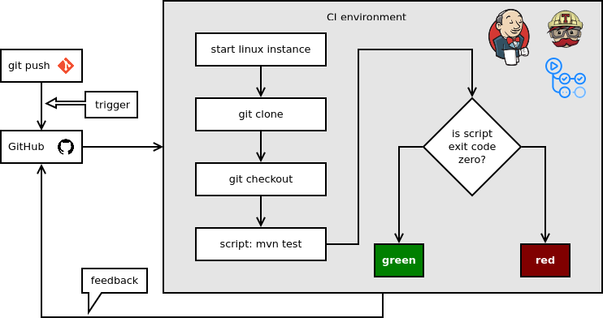

# Continuous Integration

- [What is Continuous Integration](https://www.atlassian.com/continuous-delivery/continuous-integration)
- [Continuous Integration](https://martinfowler.com/articles/continuousIntegration.html)

Ennek alapja a verziókövetés, a fejlesztő pusholja a módosításait a szerverre, amely lefordítja a kódot, lefuttatja a teszteket (és egyéb elemzéseket), ezek sikerességéről visszajelzést ad. Kicsit bővebben [itt](#ci-k%C3%B6rnyzet).

## Interrupts

[The Cost of Interruption for Software Developers](https://www.brightdevelopers.com/the-cost-of-interruption-for-software-developers/)

Az automatizálás csökkenti az interruptokat, a költségeket és azonnali visszajelzést ad!

## Automation

- [Automating Software Development Processes](https://www.developerdotstar.com/mag/articles/automate_software_process.html)

<!--how does it work

version control
build automation
self-stesting-->

## Build scripts

Az egész CI/CD lelke egy adag script, amelyben le vannak írva az automatizált lépések. Úgy mint...

- kód fordítása (make, maven, stb.)
- bináris előállítása
- statikus kódelemzés futtatása, pl. MISRA, Checkstyle
- tesztlefedettség kiszámolását végző szoftver futtatása
- riport generálás a feedbackhez a fejlesztőnek, menedzsmentnek, megrendelőnek
- stb.
- ezek futása lehet...
    - on demand: jellemzően a CI környezetekben kézzel is újra lehet futtatni egy adott _job_-ot
    - ütemezett: adott időben ütemezetten fusson (lásd nightly buildek). Pl. egy teljes rendszer teszt, amely akár órákon át is futhat, azt célszerű lehet szó szerint éjjel futtatni, és a reggeli munkakezdésre van egy riport arról, hogy az előző napi változtatások mit törtek el (pl.)
    - triggerelt: valamilyen esemény hatására fusson le. Pl. egy commit-ra, így minden pusholt commit-ra lefuthatnak a különböző szintű tesztek, statikus kódellenőrzés, stb.

## Software Testing

- [What is Software Testing? Introduction, Definition, Basics & Types ](https://www.guru99.com/software-testing-introduction-importance.html)
  - Végig lehet lépkedni az egyes fejezeteken, igen jól kimeríti a témát, olyan fejezetei is vannak, amire az előadás nem tért ki.
  - Több fejezetére specifikusan másutt is hivatkozok

## Test Strategies

- [Black vs White vs Gray Box Testing](https://artoftesters.wordpress.com/2014/02/03/black-vs-white-vs-gray-box-testing/)
- [What is WHITE Box Testing? Techniques, Example, Types & Tools](https://www.guru99.com/white-box-testing.html)

## Automated Testing

- [Automation Testing Tutorial](https://artoftesting.com/automation-testing)
- [The different types of tests ](https://www.atlassian.com/continuous-delivery/software-testing/types-of-software-testing)

## Integration Testing

[Remek összeföglaló a témában](https://www.guru99.com/integration-testing.html), amely kitér a megközelítésekre: Bottom-up, Top-down, Hybrid/Sandwich, Big Bang.

<!--## Feature Testing -->

## System Testing

- [System testing](https://www.guru99.com/system-testing.html)
- [shadow deploy](https://christophergs.com/machine%20learning/2019/03/30/deploying-machine-learning-applications-in-shadow-mode/#what)

### Software-in-the-loop (SIL)

forrás: [autonóm autofejlesztés tesztelése](https://www.intellias.com/three-ways-of-testing-adas-in-autonomous-cars-beyond-a-test-drive/)

### Hardware-in-the-loop (HIL)

forrás: [autonóm autofejlesztés tesztelése](https://www.intellias.com/three-ways-of-testing-adas-in-autonomous-cars-beyond-a-test-drive/)

## Acceptance Testing

- [Acceptance Testing](http://softwaretestingfundamentals.com/acceptance-testing/)
- [What is Acceptance Testing](https://www.softwaretestinghelp.com/what-is-acceptance-testing/)

## SMART Objectives

# Continuous Deployment

- [Six Strategies for Application Deployment](https://thenewstack.io/deployment-strategies/)
- [Feature Flag Driven Development](https://featureflags.io/2015/11/03/feature-flag-driven-development-by-justin-launchdarkly/)
  - > This article provides a broad and comprehensive overview of feature flag driven development, from gradual rollouts to A/B testing.

# Continuous Delivery

- [Continuous delivery VS traditional release model](https://www.linkedin.com/pulse/continuous-delivery-vs-traditional-release-model-szczepan-faber)

# DevOps

- [What Is DevOps?](https://theagileadmin.com/what-is-devops/)
- [DevOps](https://thenewstack.io/category/devops/)

# Alkalmazott eszközök

A tárgyhoz használt tényleges eszközök, mondhatjuk, hogy a fentiek (egy részének) gyakorlati alkalmazása.

## CI környzet

Korábban [Travis CI](https://travis-ci.org/), újabban (mióta van) [GitHub Actions](https://help.github.com/en/actions/getting-started-with-github-actions/about-github-actions).

A commit(ok) pusholása esemény hatására elindul a build környezet, ez egy Ubuntu linux, amely tartalmazza a Java fejlesztői környezetet (JDK) és a fordítást menedzselő eszközt (Maven). Leklónozza a repót, kiválasztja a kérdéses branch-et, lefordítja a kódot, lefuttatja a teszteket, meghívja a statikus kódelemzőt és a tesztlefedettség elemzőt, az előállt riportokat elküldi az ezt nyilvántartó szolgáltatásoknak. Ha valamennyi teszt sikeres, akkor zöld jelzést ad. (A Jenkins időjárásikonokat használ historikusságot is figyelembe véve: sok egymást követő bukó teszt (viharfelhők) után egy sikeres még nem jelent azonnal napocskát...)

A Pull Request-ek elfogadásának feltétele a fordítható kód és a sikeres tesztek, de a statikus kódelemző és a tesztlefedettség elemző visszajelzése is megjelenik (automatizált review formájában). Ugyanilyen automatizált review-nak tekinthető az is, hogy van-e kódütközés.

Ezeken kívül a kollégák manuális review-ja is szükséges (2 approve), lásd review protokol.

### Példák

- [Nagyon egyszerű konfigurációs állomány Travis-hez](https://github.com/SzFMV2020-Tavasz/AutomatedCar-A/blob/master/.travis.yml)
- [Aktuális GitHub Actions konfiguráció](https://github.com/SzFMV2020-Tavasz/AutomatedCar-A/blob/master/.github/workflows/maven.yml)

## Statikus kódelemzés

A statikus kódelemzést Java nyelvhez a Checkstyle végzetre, C#-hoz a StyleCop, ez lokálisan (lásd fejlesztőeszközök fejezet) is működik, a változások követéséhez és mindenféle riport generálásához (első sorban a Pull Requestekhez) a [CoceFactor.io](https://www.codefactor.io/) van bekötve. Ez össze van linkelve a GitHubbal repóval, a commit triggerre saját környezetben kicsekkolja az aktuális branchet, lefuttatja a Checkstyle-t (és adott esetben más elemzőket is), majd elkészíti a riportokat.

## Tesztlefedettség

A Java kódunk tesztekkel való lefedettségét Java nyelvhez a JaCoCo (Java Code Coverage) nevű szoftver számolta ki, C#-hoz a Coverlet. Szintén működik lokálisan is (lásd fejlesztőeszközök fejezet), a CodeFactorhoz hasonló online riportgeneráló amit a repónkhoz beállítottam az a [CodeCov](https://codecov.io/). Az előbbivel analóg módon működik.

## Stale bot

A [stale bot](https://probot.github.io/apps/stale/) funkciója, hogy a magára hagyott hibajegyeket (issue) megjelöli „megrekedt” (stale) állapottal (címkével), ha adott ideig (nálunk 1 hét) nem volt vele kapcsolatos aktivitás. Ez alól kivételt képeznek a „user story” címkéjű issue-k.

A konfigurációja a repó [`.github/stale.yaml`](https://github.com/SzFMV2020-Tavasz/AutomatedCar-A/blob/master/.github/stale.yml) fájljában található.
