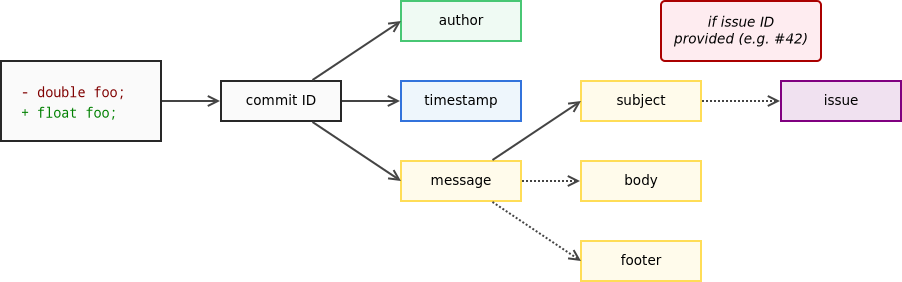

# Daily Work

<!-- toc -->


## Communication

- A Remote communication strategies kifejezetten hasznos a [GitLab távmunka kézikönyvéből](https://learn.gitlab.com/all-remote/remote-playbook)
    - 18-26. oldal

> I am only responsible for what I said, not for what you understood

Igaz ez? Miért nem?

Számítsd bele, hogy a másik nem ugyanazzokkal az előismeretekkel rendelkezik, nem ugyanazzal a fogalomkészlettel, terminológiával, esetleg anyanyalvvel.

- [A Software Developer’s Guide to Project Communication: Part 1](https://www.lullabot.com/articles/effective-communication-part-1-greasing-the-wheels)
    - a [2. rész](https://www.lullabot.com/articles/effective-communication-part-2-crossing-the-streams) is ajánlott
- [Communication on Agile Software Teams](http://www.agilemodeling.com/essays/communication.htm)

## Requirement Engineering

- [Principles of Requirements Engineering](https://www.inflectra.com/Ideas/Whitepaper/Principles-of-Requirements-Engineering.aspx)
- Egy több részes cikk sorozat a Requirements Engineering-ről:
  - [Introduction (Part 1)](https://medium.com/omarelgabrys-blog/requirements-engineering-introduction-part-1-6d49001526d3)
  - [Elicitation & Analysis (Part 2)](https://medium.com/omarelgabrys-blog/requirements-engineering-elicitation-analysis-part-2-a02db801f135)
  - [Requirements Specification (Part 3)](https://medium.com/omarelgabrys-blog/requirements-engineering-elicitation-analysis-part-5-2dd9cffafae8)
  - [Requirements Validation (Part 4)](https://medium.com/omarelgabrys-blog/requirements-engineering-requirements-validation-part-6-29778d7bde24)
- [Requirements Engineering vs. Business Analysis](https://enfocussolutions.com/requirements-engineering-vs-business-analysis/)

---

- [HOW TO SPLIT A USER STORY](http://www.agileforall.com/wp-content/uploads/2012/01/Story-Splitting-Flowchart.pdf)
  - PDF, 1 oldal, flowchart
  - [Bővebben](https://www.humanizingwork.com/the-humanizing-work-guide-to-splitting-user-stories/)

## Coding

<!--  -->


A TDD-ről részletesen a [TDD fejezetben](tdd.md).

### Cserkész szabály

> Always leave the campground cleaner than you found it
>
> -- Robert C. Martin (Uncle Bob)

- [Leave the code cleaner than the way you have found it!](https://codeburst.io/leave-the-code-cleaner-than-the-way-you-have-found-it-58c8e4ab3e83)

## Clean Code

> Always code as if the guy who ends up maintaining your code will be a violent psychopath who knows where you live. Code for readability. [source](https://groups.google.com/forum/#!msg/comp.lang.c++/rYCO5yn4lXw/oITtSkZOtoUJ)

A viccet félretéve az egész lényege az érthetőség és a karbantarthatóság. Két hét múlva is meg kell értened a saját kódod és nem csak neked.

<!--Elég vázlatos [összefoglalása](https://github.com/lastRoot/notes/wiki/Clean-Code-Rules-in-Java)-->

### Meaningful Names

Az alábbiak Robert C. Martin Clean Code című könyvénből a 2. fejezet (Meaningful Names) alfejezet címei, az idézetek is onnan valók.

- Use Intention-Revealing Names
    - > `int d; // elapsed time in days`
    - > `int elapsedTimeInDays;`
- Avoid Disinformation
- Make Meaningful Distinctions
    - > It is not sufficient to add number series or noise words, even though the compiler is satisfied. If names must be different, then they should also mean something different.
- Use Pronounceable Names
    - > If you can’t pronounce it, you can’t discuss it without sounding like an idiot. “Well, over here on the bee cee arr three cee enn tee we have a pee ess zee kyew int, see?”
    - Külön szempont ez nem angol anyanelyvűeknél, némely szavakat bonyolultabb kiejtenünk
- Use Searchable Names
    - > Single-letter names can ONLY be used as local variables inside short methods. *The length of a name should correspond to the size of its scope.*
- Avoid Mental Mapping
    - > Readers shouldn’t have to mentally translate your names into other names they already know.
    - > clarity is king
- Avoid Encodings
    - a modern IDE-k esetében már teljesen fölösleges típus vagy szerepjelöléseket tenni a nevekbe
- Pick One Word per Concept
- Don’t Pun or use humor
- Add Meaningful Context
    - > Imagine that you have variables named firstName, lastName, street, houseNumber, city, state, and zipcode. Taken together it’s pretty clear that they form an address. But what if you just saw the state variable being used alone in a method?

---

Nincs megjelölve forrás, de [ez az összefogleló](http://bensmith.io/20-tips-for-better-naming) is ezen a fejezeten alapszik.

### Functions

Az alábbiak Robert C. Martin Clean Code című könyvénből a 3. fejezetén alapulnak.

- A hossza legyen a lehető legrövidebb (akár 2-4 sor, bár személy szerint azt néha túlzásnak tartom)
- Do One Thing
- Use Descriptive Names
    - egy metódus valamit _csinál_, tehát kezdődjön igével, pl. `increaseSpeed`
    - a nevéből legyen egyértelmű, hogy mit csinál
    - > Robert C. Martin [The Inverse Scope Law of Function Names](https://www.informit.com/articles/article.aspx?p=1323426): The longer the scope of a function, the shorter its name should be. Functions that are called locally from a few nearby places should have long descriptive names, and the longest function names should be given to those functions that are called from just one place.
- Function Arguments
    - Lehetőleg ne használj 3-nál több paramétert
    - > Flag arguments are ugly \[...\] loudly proclaiming that this function does more than one thing.
- Have No Side Effects
    - >  [Wikipédiából](https://en.wikipedia.org/wiki/Side_effect_(computer_science)): an operation, function or expression is said to have a side effect if it modifies some state variable value(s) outside its local environment, that is to say has an observable effect besides returning a value (the main effect) to the invoker of the operation.
    - > Side effects are lies. Your function promises to do one thing, but it also does other hidden things.
- Prefer Exceptions to Returning Error Codes
    - a korábbiakból már adódik, hogy miért jobb egy FileNotFoundException mint egy ERRCODE_26375


### Comments

> One of the more common motivations for writing comments is bad code. We write a module and we know it is confusing and disorganized. We know it’s a mess. So we say to ourselves, “Ooh, I’d better comment that!” No! You’d better clean it!
>
> -- Robert C. Martin: Clean Code, pp 55.

- Gyakori a kód strukturálása kommentekkel, ilyenkor célszerű függvényeket használni inkább
- Kerülendő a TODO és a FIXME a kommentekben, ez azt jelenti, hogy nem vagy készen
- Kommentezni ajánlott viszont -szerintem- a domain specifikus részeket, amelyek megértését nem feltétlenül lehet elvárni egy fejlesztőtől. Pl. egy fizikai számítás.
- Továbbá nem haszontalan a dokumentációs kommentezés pl. Javadoc, kivéve ha egy `increaseSpeed` metódus kommentje annyi, hogy _"this method increases the speed"_, sokkal többet mondana az, hogy mennyivel, milyen korlátok között stb. amelyek révén aztán hasznos lesz a generált API dokumentáció anélkül, hogy a kódba kellene nézni.
<!--
- https://www.freecodecamp.org/news/code-comments-the-good-the-bad-and-the-ugly-be9cc65fbf83/
- [When Good Comments Go Bad](https://blog.codinghorror.com/when-good-comments-go-bad/)
-->

---

<center>
    
</center>

---


## Verziókezelők


### Mi a verziókezelő?

> Version control, a.k.a. revision control / source code management, is basically a system for recording and managing changes made to files and folders. It is commonly used to manage source code, however, it is also well suited to tracking changes to any kind of file which contains mostly text.
>
> -- [forrás](http://smutch.github.io/VersionControlTutorial/pages/0-intro.html#what-is-version-control)

Az ember hajlamos ad-hoc módon is verziózni a munkáját, pl.[^1]:


Több szolgáltatás és szoftver alapból tartalmaz verziókövetést, pl. a Dropbox, Google Drive, stb. is verziózza a feltöltött állományokat; az MS Word még [merge-elni is tudja az egyes verziókat](https://support.microsoft.com/en-us/office/combine-document-revisions-f8f07f09-4461-4376-b041-89ad67412cfe?ui=en-us&rs=en-us&ad=us).

Michael Ernst [összefoglalója alapján](https://homes.cs.washington.edu/~mernst/advice/version-control.html):

- **Version control enables multiple people to simultaneously work on a single project.** Each person edits his or her own copy of the files and chooses when to share those changes with the rest of the team. Thus, temporary or partial edits by one person do not interfere with another person's work.
- Version control also enables one person you to use multiple computers to work on a project, so it is valuable even if you are working by yourself.
- **Version control integrates work done simultaneously by different team members.** In most cases, edits to different files or even the same file can be combined without losing any work. In rare cases, when two people make conflicting edits to the same line of a file, then the version control system requests human assistance in deciding what to do.
- **Version control gives access to historical versions of your project.** This is insurance against computer crashes or data lossage. If you make a mistake, you can roll back to a previous version. You can reproduce and understand a bug report on a past version of your software. You can also undo specific edits without losing all the work that was done in the meanwhile. For any part of a file, you can determine when, why, and by whom it was ever edited.


### Mit érdemes verziókezelni

> "In practice, everything that has been created manually should be put in version control, including programs, original field observations, and the source files for papers."
>
> -- Best Practices for Scientific Computing; Wilson et al. 2012 ([arXiv:1210.0530](https://arxiv.org/abs/1210.0530))

Az ehhez a jegyzethez készített ábrák és azok forrása is verziókezelés alatt van, ezek a `.png` és `.dia` állományok a `/src/images/` mappában, utóbbiak valójában egy [diagramszerkesztő alkalmazás](https://wiki.gnome.org/Apps/Dia) XML alapú forrásfájljai.

<!--
### Verziókezelési modellek

- Lock-Modify-Unlock
- Copy-Modify-Merge
-->

- [Ez az írás](https://tortoisesvn.net/docs/nightly/TortoiseSVN_en/tsvn-basics-versioning.html) összefoglalja a verziókezelési modelleket (Lock-Modify-Unlock, Copy-Modify-Merge), [emez pedig](https://homes.cs.washington.edu/~mernst/advice/version-control.html) összehasonlítja a centralizált és az elosztott verziókezelőket.
- [About Version Control](https://git-scm.com/book/en/v2/Getting-Started-About-Version-Control)
  - a Git könyv első fejezete, rövid összefoglaló
- gyakorlati oldalról lást [Git](../git.md) fejezet

[^1]: http://smutch.github.io/VersionControlTutorial/pages/0-intro.html#what-is-version-control


### Centralizált verziókezelő


### Elosztott verziókezelő


### Branching

- [Git Branching - Basic Branching and Merging](https://git-scm.com/book/en/v2/Git-Branching-Basic-Branching-and-Merging)
- [Gyakorlati oktatóanyagok](../git.md#interaktív-online-oktató-anyagok)

A félév során a [GitHubFlow](https://guides.github.com/introduction/flow/)-t használjuk, részletek a [GitHub fejezetben](../github.html#branching-model).

<!--  -->
<!--

#### További írások a témában

* [The Definitive Guide to Forks and Branches in Git](https://www.pluralsight.com/blog/software-development/the-definitive-guide-to-forks-and-branches-in-git)
* [a simple git branching model](https://gist.github.com/jbenet/ee6c9ac48068889b0912)
* [OneFlow – a Git branching model and workflow](https://www.endoflineblog.com/oneflow-a-git-branching-model-and-workflow#oneflow-advantages)
* [Comparing Workflows](https://www.atlassian.com/git/tutorials/comparing-workflows)
* [Git branching and forking in the enterprise: why fork?](https://www.atlassian.com/blog/git/git-branching-and-forking-in-the-enterprise-why-fork)
* [Using the Fork-and-Branch Git Workflow](https://blog.scottlowe.org/2015/01/27/using-fork-branch-git-workflow/)
* [Stackoverflow / Forking vs. Branching in GitHub](https://stackoverflow.com/a/34343080/4737417)
* [A succesful Git branching model considered harmful](https://barro.github.io/2016/02/a-succesful-git-branching-model-considered-harmful/)
* [Escape from Merge Hell: Why I Prefer Trunk-Based Development Over Feature Branching and GitFlow](https://stxnext.com/blog/2018/02/28/escape-merge-hell-why-i-prefer-trunk-based-development-over-feature-branching-and-gitflow/) -->


### Commit üzenetek


A [How to Write a Git Commit Message](https://chris.beams.io/posts/git-commit/) egy hosszabb, példákkal illusztrált írás a jó commit üzenetekről, amely [hét szabályban](https://chris.beams.io/posts/git-commit/#seven-rules) foglalja össze, hogy mire kell figyelni. Ezt egészíteném ki egy nyolcadikkal.

1. [Separate subject from body with a blank line](https://chris.beams.io/posts/git-commit/#separate)
2. [Limit the subject line to 50 characters](https://chris.beams.io/posts/git-commit/#limit-50)
3. [Capitalize the subject line](https://chris.beams.io/posts/git-commit/#capitalize)
4. [Do not end the subject line with a period](https://chris.beams.io/posts/git-commit/#end)
5. [Use the imperative mood in the subject line](https://chris.beams.io/posts/git-commit/#imperative)
6. [Wrap the body at 72 characters](https://chris.beams.io/posts/git-commit/#wrap-72)
    - ez a legkevésbé fontos
7. [Use the body to explain what and why vs. how](https://chris.beams.io/posts/git-commit/#why-not-how)
8. **Reference the issue!**


#### Miért fontos a 8. pont?

Valójában (bizonyos szempontból) az issue behivatkozása a legfontosabb, méghozzá a **visszakövethetőség** (traceability) miatt.



Minden módosítás (a verziókövető rendszerben) rendelkezik egy azonosítóval, amelyhez társul, hogy ki és mikor végezte el a módosítást. Valamit egy üzenet, amely -- jó esetben -- leírja, hogy mi volt ez a módosítás. A visszakövethetőség egy adott szintig tehát szerves része a verziókövető rendszereknek.

A módosítások azonban nem csak úgy ötletszerűen történnek, hanem valamilyen feladat által meghatározott célból. Pl. jelenítsd meg a műszerfalon az autó pillanatnyi sebességét (feature), vagy javítsd ki pixel/s -> km/h átváltást, mert kerekítési hiba miatt értelmetlen érték jelenik meg (bugfix).

Ugyanakkor a feladatok (task) sem csak úgy lógnak a levegőben, jellemzően kapcsolódnak egy user story-hoz (különösen a feature-ök), de biztosan kapcsolódnak egy sprinthez (hiszen beütemezték a megoldását valamikorra), van felelősük, határidejük, stb. Úgy általában van véve egy kontextusuk. Az issue (más néven task) tartalmazza az adott feladat pontos részleteit, az issue/task trackerben akár a megoldás teljes vitafolyamata megtalálható. Pl. ki hogyan akarta implementálni, milyen érvek és ellenérvek merültek fel az egyes implementációs lehetőségek mellett/ellen, hogyan jutott a fejlesztőcsapat konszenzusra, vagy ki hagyta jóvá az adott módosítást, ki döntött arról, hogy melyik sprintbe kerüljön be, stb.

A visszakövethetőség nem csak addig a pontig érdekes és fontos, hogy ki írta át a változó típusát (pl.), hanem a teljes tervezési/döntés folyamatig visszamenőleg.

Mi van akkor ha a döntés egy face-to-face meetingen (pl. standup), skype konferenciahíváson vagy egyéb nem írásos formában történt?
(A szó elszáll, írás megmarad...)

Ebben az esetben, az issue kiváló hely arra, hogy írásban is rögzítve legyenek az elhangzottak. Pl. YYYY-MM-DD-ei megbeszélés alapján az XY library segítségével fogom implementálni az analóg fordulatszámkijelzőt. Akár explicit írásos jóváhagyást is lehet kérni...


#### További „iskolák”

- Az [AngularJS Git Commit Message Conventions](https://github.com/angular/angular/blob/master/CONTRIBUTING.md#commit) a commit üzenet fejlécét a `<type>(<scope>): <subject>` szabály szerint követeli meg.
  - ahol [típus](https://github.com/angular/angular/blob/master/CONTRIBUTING.md#type) lehet build, ci, docs, feat, fix, perf, refactor, style vagy test
  - valójában a 1., 4. és 5. pontot ez is megköveteli; a 3.-al pont szembemegy, aminek oka, hogy a tárgy típusmegjelöléssel kezdődik, nem a tárgy szövegével
  - a tárgy és törzs sorhosszára 100 karakteres limitet ad, szemben a fenti hagyományos (akár úgy is lehet érteni, hogy elavult) terminálméretekre szabott korlátaival
- Egy másik, az Angularéhoz nagyon hasonló a [Conventional Commits](http://conventionalcommits.org/)
- Ezek előnye lehet -megfelelő tooling mellett- pl. az automatizált changlelog generálás
  - nálunk nincs ilyesmire beállított eszköz


#### Mire jó még a commit üzenet?

Például arra is alkalmas, hogy [lezárjunk vele egy issue-t](https://help.github.com/en/github/managing-your-work-on-github/linking-a-pull-request-to-an-issue#linking-a-pull-request-to-an-issue-using-a-keyword). Ha a commit üzenet törzse tartalmazza a _close_, _closes_, _closed_, _fix_, _fixes_, _fixed_, _resolve_, _resolves_ vagy _resolved_ utasítások egyikét, akkor a GH automatikusan zárja az issue-t amint az a fő ágba (master) került. Pl.

```
Fix px/s -> km/h conversion #28

Fixes #28
```


### Mikor commit-oljunk?

A fentiekből már látszik, hogy az egésznek akkor van értelme, ha egy-egy commit egy jól megválasztott mértékű módosítást rögzít. Az a megközelítés, hogy a munkanap végén nyomok egy commitot valami olyasféle üzenettel, hogy `Changes on YYYY-MM-DD` nem nagyon szolgálja a visszakövethetőséget.

Egy taszk hossza 1-4 óra (főállású fejlesztőre értelmezve), de fontos, hogy egy megszakítás nélkül elvégezhető feladat legyen. Ez azt jelenti, hogy egy taszk egyenlő egy committal? Nem. Egy taszk megoldása természetesen több commitból is állhat.

A [When to make a Git Commit](https://dev.to/gonedark/when-to-make-a-git-commit) poszt[^1] alapján (is), azt mondanám, hogy akkor érdemes commitolni, ha:

1. Befejeztem egy egységnyi munkát.
2. Olyan módosítást végeztem, amit esetleg visszavonnék.

Az egységnyi munka módosított sorok és fájlok tekintetében rendkívül változó lehet. Egy bugfix pl. állhat egyetlen karakter módosításából, de egy refaktorálás során egy metódus átnevezése járhat tucatnyi fájl módosításával (ahol az adott metódus használva volt). Ugyanakkor a metódusátnevezés után biztosan érdemes lehet commitolni, egyéb módosítást már nem csapnék hozzá.

Ha a commit üzenetbe azt írnád, hogy `Rename foobar method and fix typo in the comment #42` már biztosan két külön commitra lenne szükséged.

[^1]: a hozzá tartozó kommenteket is érdemes átfutni


## Review

- [Review fejezet](./review.md)

### A tárgy során


<!--## Java kódformázás-->
