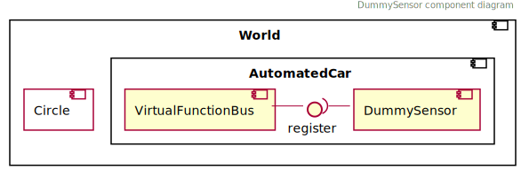
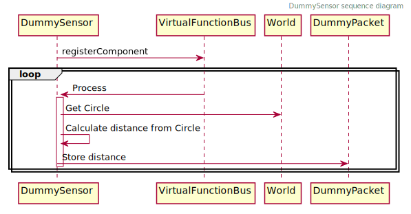
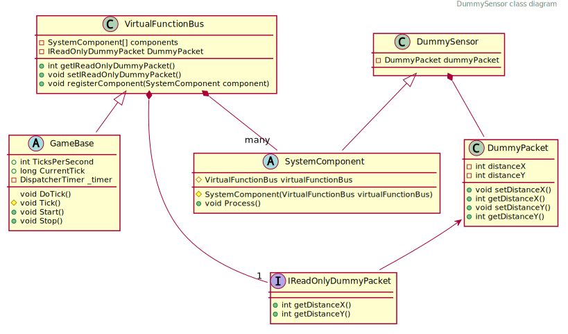
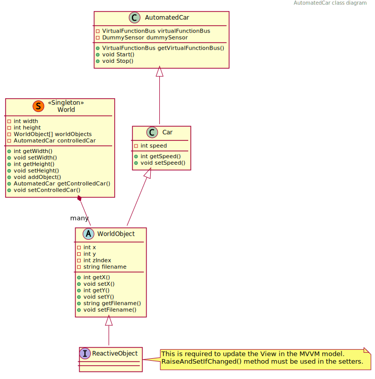
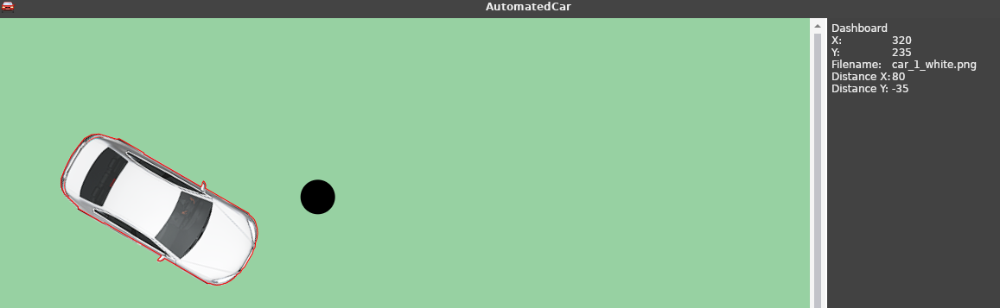

# Referencia architektúra

A repó található kezdeti kódot (skeleton) egységes alapot képez a félév során megvalósítandó szoftver számára, azonban nem kíván tökéletes és teljes megoldást biztosítani a feladat egyetlen elemére sem, mindösszesen példaként szolgál a következőkre:

- projekt struktúra
- grafikus felület létrehozása
    - WPF keretrendszerrel
    - Avalonia keretrendszerrel
- világmodell benépesítése
- vezérelt autó példányosítása és kiválasztása
- képfájl betöltése projektkönyvtárból
- világobjektumok rajzolása MVVM rendszerben
- vezérelt autó állapotának megjelenítése a műszerfalon
- ütemező használata
- billentyű lenyomás és felengedés esemény kezelése
- szenzor objektum létrehozása
- adatcsomag küldése és fogadása a *Virtual Function Bus*-on keresztül

<!-- A fejezet további felépítse: -->

<!-- toc -->


## Átfogó kép

A teljes szoftver moduljai [12 user story](sprints.md)-ra vannak bontva. Az egyes modulok a teljes szoftver egy-egy komponensét valósítják meg. A legtöbb ilyen komponens a vezérelt autón belül kap majd helyet. Azonban vannak olyan komponensek (irányítás és megjelenítés), amelyek  nem csak az autón belül, de azon kívül, a keretszoftverben működnek.


A billentyűzet események kezelése értelemszerűen a szoftverban történik, amelyet aztán a szimulált autó kezelőszerveire (gáz- és fékpedál, kormány) kell leképezni.
A megjelenítésnek pedig értelemszerűen a teljes világot, de legalábbis az autó egy környezetét kell, hogy kirajzolnia.


## Virtual Function Bus

A VirtualFunctionBus (VFB) egy kommunikációs megoldás az AutomatedCar komponensei (SystemComponent) számára. A komponensek feliratkoznak a buszra és **a feliratkozás sorrendjében** ciklikusan meghívásra kerül a `Process()` metódusok.

Ebből következik, hogy a feliratkozást az ábrán látható sorrendben kell megtenni, mivel az adatáramlásnak ilyen irányultsága van. Az ábra a kód kezdeti állapotát szemlélteti, a munka során további modulok (szenzorok, vezetés támogató rendszerek) is csatlakoznak majd. Valamint a hajtáslánc és a kormányzás modult nem kötelező ennyire élesen szétválasztani.


Minden adatközlő modulnak létre kell hoznia egy-egy csomag (packet) típust (és vele párhuzamosan egy az olvasást biztosító interfészt), amely tartalmazza azokat az információkat amelyeket továbbítania kell. Például az input modul a pedál és kormány állásokat. A hajtáslánc a következő, kiolvassa a pedál és váltó állást, számol vele, majd visszaírja a _saját_ csomagjába motor fordulatszámát és az autó sebességét, stb. Ezekre legközelebb a kormányzás modulnak lesz szüksége, az kiolvassa ugyanúgy mint az input modul kormányállás értékét, számol vele, majd visszaírja a autó adott iterációra vonatkozó elmozdulását.


### Használata általánosan

1. Create a new package (e.g. SteeringAnglePacket)
2. Create a new interface for it (e.g. IReadonlySteeringAnglePacket)
3. Add reference to the owner component (e.g. SteeringSystem)
4. Add the interface reference to the VirtualFunctionBus
5. In the loop method of the writing componenet set the payload value of the packet
6. In the loop method of the reading compontent read the payload of the packet


### Konkrét példán keresztül: DummySensor

A *DummySensor* egy rendkívül primitív „szenzor”: egyetlen feladata, hogy kiszámolja az egocar ás a *Circle* objektum közötti távolságot. Pontosabban az egocar és a kör referenciapont X, Y koordinátáinak különbségét. Azonban ez is teljes mértékben képes bemutatni a szenzorok működését és a buszon keresztüli adatcserét.

A példa szempontjából releváns komponensek viszonyát alábbi ábra szemlélteti.



<!--
```plantuml
{{#include plantuml/dummy_sensor_component.puml}}
```
-->

A *World* singleton osztály tartalmaz minden *WorldObject*-et és tartalmaz referenciát a vezérelt autóra, amely közvetetten szintén *WorldObject*, csakúgy mint a *Circle*. Az *AutomatedCar* tartalmazza a *VirtualFunctionBus*-t, mivel ez az autó komponenseinek kommunikációs csatornáját valósítja meg. Szintén az *AutomatedCar* tartalmazza a szenzorokat, jelen esetben a *DummySensor*-t.

Ahhoz, hogy a szenzorok (vagy egyéb komponensek mint a hajtáslánc például) adatot cserélhessenek fel kell iratkozniuk a VFB-ra. Miután a feliratkozás megtörtént, a VFB minden ciklusában meghívja a `Porcess()` metódusát. A *DummySensor* esetében ez a metódus elkéri a világtól a *kör* objektumot, kiszámolja a vezérelt autó és a kör távolságát, majd ezt a távolságot eltárolja a *DummyPacket* objektumban (amely egy IReadOnlyDummyPacket típuson keresztül a VFB-ban van tárolva).

<!-- A szenzor része az *AutomatedCar*-nak, közvetlenül hozzáférhet a világhoz (*World*) mivel az singleton. Lekéri a világobjektumok közül a kört (*Circle*), majd kiszámolja a koordináták különbségét a `process()` metódusban és az eredményt eltárolja az `dummyPacket` változóban. -->

A `dummyPacket` referenciája eltárolásra került a *VirtualFunctionBus*ban, amely referenciáját a a szenzor konstruktorának biztosítani kell. Ehhez előzetesen létre kell hozni egy `IReadOnlyDummyPacket` típusú változót a VFB-ban.

Miután a `DummyPacket` megvalósítja az `IReadOnlyDummyPacket` interfészt, a VFB-ban az utóbbi típus tárolására szolgáló változó kerül deklarálásra. Ezzel biztosítható, hogy az adott értéket csak a csomag tulajdonosa (jelen esetben a *DummySensor*) tudja majd írni, de minden más komponens olvashatja a VFB-on keresztül.

<!--
```plantuml
{{#include plantuml/dummy_sensor_sequence.puml}}
```
-->



Ez lejátszódik minden iterációban, így a kör és a vezérelt autó mindenkori helyzete szerinti távolságot fogja tartalmazni a *DummyPacket*.


<!-- Az alábbi ábra a *DummySensor* szenpontjából fontos osztályok kapcsolatát mutatja. -->

### Osztálydiagramok

<!--
```plantuml
{{#include plantuml/dummy_sensor_class.puml}}
```
-->



<!--
```plantuml
{{#include plantuml/automatedcar_class.puml}}
```
-->




## Megjelenítés

Az elkészítendő szoftver felhasználói felületének az alábbi vázlat felépítését kell követnie.


A programablak bal oldalán a virtuális világ egy szeletét látjuk ezért felel a vizualizációs modul. A megjelenítés középpontja az mindenkor vezérelt autó (egocar). A világ minden eleméhez tartozik egy képfájl, ezen elemek megfelelő transzformációk (forgatás, skálázás) végrehajtása után kirajzolásra kerülne a CourseDisplayre.

Továbbá erre a részre kerülnek kirajzolásra a debuggoláshoz és teszteléshez használandó segédobjektumok opcionálisan bekapcsolható megjelenítése. Ide tartozik a szenzorok látómezeje, a világobjektumok „poligon váza”, valamint utóbbiak eseményre történő kiemelésének lehetősége.


A jobb oldalon a műszerfal található. A műszerfalon nincsenek vezérlőelemek, csak megjelenítés. Az összes kapcsoló a billentyűzettel állítható, a grafikus elemeknek nem kell pl. egérrel kapcsolhatónak lenniük.

A fordulatszám és a sebesség legyen egy analóg órával reprezentálva; a kormány elforgatás, a gáz- és fékpedál állása progressbar-okkal szemléltethető. Az irányjelző visszajelzője és a vezetéstámogató funkciók visszajelzői lámpaszerűek, a sebességváltó állása, és a debug értékek pl. kocsi pozíciója (x, y koordináta) lehet szöveges.
A buszon közölt „utoljára látott tábla” képét ki kell tudni rajzolni (a képek rendelkezésre állnak). Legyen elkülönítve a nincs tábla eset is.

A megjelenítéshez tetszőleges grafikus keretrendszer választható, alább a skeleton két változatban kerül bemutatásra.

## WPF alapú megjelenítés

Az ismert WPF alapú implementáció, amely egyenértékű a később taglalt Avalonia alapú megoldással. Mindkettő XAML alapú, MVVM modellű keretrendszer, előbbi Windows-os, utóbbi platform független.

A főablak két UserControlt tartalmaz, az egyik a CourseDisplay, a másik a Dashboard, azért lettek szétválasztva, hogy a két komponensen dolgozó csapatoknak ne kelljen egymás munkájába nyúlkálniuk.

Például, alább látható a műszerfal, amely egy *AutomatedCar* objektum megjelenítését végzi. Egészen pontosan a *World*-ben tárolt `controlledCar` objektumét. A `ControlledCar` tulajdonság egy referencia az éppen vezérelt autóra (elvben lehetne a világban több `AutomatedCar` példány és ezek között váltogathatnánk is. Ilyen esetben a `ControlledCar` mindeg az aktuálisra mutat, amelyet meg akarunk jeleníteni). A *DashboardView* a *DashboardViewModel*-en keresztül a `controlledCar`-hoz van kötve.

```xml
<ContentControl Name="Dashboard" Content="{Binding World.ControlledCar, Mode=OneWay}" >
    <ContentControl.ContentTemplate>
        <DataTemplate DataType="{x:Type models:AutomatedCar}">
            <StackPanel>
                ...
            </StackPanel>
        </DataTemplate>
    </ContentControl.ContentTemplate>
</ContentControl>
```

A példakód ezt biztosítja, a feladat a konkrét visszajelzőkhöz megfelelő felületi elemek definiálása.

### CourseDisplay

A teljes CourseDisplay lényegében egy *ItemsControl*, amely a világ `WorldObjects` tulajdonságához van kötve. Ezen belül található egy *Canvas*, amire a rajzolás történik, valamint egy *DataTemplate*, amely azt írja le, hogy egy *WorldObject* típusú objektumok hogyan kell kezelni. A világelemhez tartozó képet kell kirajzolni, így tartalmaz egy *Image*-et, amelynek forrása a *WorldObject* `Filename` tulajdonsága. A *Converter* attribútumon keresztül meg lehet hívni egy függvényt, amellyel akár befolyásolni lehet a rajzolást (transzformálás).

A *WorldObject* -az alkalmazás szempontjából- a világ minden elemének őse, de ennél specializáltabban is lehet definiálni *template*-eket. Az alábbi kódrészlet szétbontja *Circle* és *AutomatedCar* típusokra, előbbihez nem is képet tölt be, hanem közvetlenül rajzol a *Canvas*-re. Az utóbbi esetben egyrészt a fentivel megegyező módon betölt egy képet, valamit arra kirajzol egy poligont (ez a debug funkcióknál kell majd).

```xml
<ItemsControl Name="CourseDisplay"
    ItemsSource="{Binding WorldObjects, Mode=OneWay}"
    Width="{Binding Width, Mode=OneWay}"
    Height="{Binding Height, Mode=OneWay}"
    HorizontalAlignment="Left" VerticalAlignment="Top"
    >

     <ItemsControl.ItemContainerStyle>
        <Style TargetType="ContentPresenter">
            <Setter Property="Canvas.Left" Value="{Binding X}"/>
            <Setter Property="Canvas.Top" Value="{Binding Y}"/>
            <Setter Property="Canvas.ZIndex" Value="{Binding ZIndex}"/>
        </Style>
    </ItemsControl.ItemContainerStyle>

    <ItemsControl.ItemsPanel>
        <ItemsPanelTemplate>
            <Canvas />
        </ItemsPanelTemplate>
    </ItemsControl.ItemsPanel>

    <ItemsControl.Resources>
        <DataTemplate DataType="{x:Type models:Circle}">
            <Canvas>
                <Ellipse Fill="black" Width="{Binding Width}" Height="{Binding Height}" Panel.ZIndex="10"/>
            </Canvas>
        </DataTemplate>
        <DataTemplate DataType="{x:Type models:AutomatedCar}">
            <Canvas>
                <Image Width="{Binding Width}" Height="{Binding Height}"
                    Source="{Binding Filename, Converter={x:Static visualization:WorldObjectTransformer.Instance}}"/>
                <Polyline Stroke="red" Points="{Binding Geometry.Points, Mode=OneWay}" />
            </Canvas>
        </DataTemplate>
    </ItemsControl.Resources>
</ItemsControl>
```

A skeletonban esetben az objektum nem a képet tárolja, hanem a képfájl nevét (`Filename`, ez van a Source-hoz kötve), a fájlnévből pedig egy konverter segítségével kap a megjelenítés képet.

Ráadásul nem is tölti be minden esetben a képfájlokat, hanem gyorsító-tárazza azokat fájlnév alapján egy `Dictionary` segítségével. A `WorldObjectTransformer` singleton, hogy ez a mechanizmus megfelelően működhessen.

```csharp
public class WorldObjectTransformer : IValueConverter
{
    private static Dictionary<string, BitmapImage> cache = new Dictionary<string, BitmapImage>();

    public static WorldObjectTransformer Instance { get; } = new WorldObjectTransformer();

    static BitmapImage GetCachedImage(string filename)
    {
        if (!cache.ContainsKey(filename))
        {
            var image = new BitmapImage(new Uri($"src/AutomatedCar/Assets/WorldObjects/{filename}", UriKind.Relative));
            image.Freeze();
            cache.Add(filename, image);
        }
        return cache[filename];
    }

    public object Convert(object value, Type targetType, object parameter, CultureInfo culture) =>
        GetCachedImage((string)value);
}
```

Megfigyelhető továbbá, hogy az AutomatedCar template esetében nem csak a kép van kirajzolva, hanem egy poligon ez, ez az objektum poligon váza, amelyet pl. ütközésekhez kell majd felhasználni. Előbb a kép, majd rá a polyline kerül kirajzolásra. Az ilyen poligonok megjelenítése debug funkciókét a megjelenítés feladata. A rajzolás pedig egy logikai értékhez kapcsolható...  

#### Pozicionálás

Megfigyelhető, hogy  a fenti példán, hogy a `ItemsControl.ItemContainerStyle` rendelkezik az objektumok pozíciójáról. Ezt CSS-szerűen működő stílusokkal lehet megadni. Az ItemsControl elemei (a WorldObject-ek) *X*, *Y* és *ZIndex* tulajdonságához van kötve a `ContentPresenter` _Canvas_ *Left*, *Top* és *ZIndex* attribútuma.

Az alábbi ábrán látható a futó alkalmazás: bal oldalt a kezdetleges CourseDisplay, jobb oldalt a kezdetleges Dashboard. Az autó az `(50, 50)` pozícióba van kirajzolva, a kör a `(400, 200)` koordinátákra (bal felső sarokkal értendő) ezek különbségét pedig kiszámolta a *DummySensor* és leolvasható a műszerfalról.


## Avalonia alapú megjelenítés

Az [*Avalonia* keretrendszer](http://avaloniaui.net/) által is használt [MVVM modell](http://avaloniaui.net/docs/quickstart/mvvm)ben az objektumokhoz tartozik egy definiált a megjelenítés.


Jelen esetben például a műszerfal egy *AutomatedCar* objektum megjelenítése. Egészen pontosan a *World*-ben tárolt `controlledCar` objektumé. A *DashboardView* a *DashboardViewModel*-en keresztül a `controlledCar`-hoz van kötve.

```xml
<ContentControl Name="Dashboard" Content="{Binding World.ControlledCar, Mode=OneWay}" >
    <ContentControl.ContentTemplate>
        <DataTemplate DataType="{x:Type models:AutomatedCar}">
            <StackPanel>
                ...
            </StackPanel>
        </DataTemplate>
    </ContentControl.ContentTemplate>
</ContentControl>
```

A példakód ezt biztosítja, a feladat a konkrét visszajelzőkhöz megfelelő felületi elemek definiálása.

### CourseDisplay

A teljes CourseDisplay lényegében egy *ItemsControl*, amely a világ `WorldObjects` tulajdonságához van kötve. Ezen belül található egy *Canvas*, amire a rajzolás történik, valamint egy *DataTemplate*, amely azt írja le, hogy egy *WorldObject* típusú objektumok hogyan kell kezelni. A világelemhez tartozó képet kell kirajzolni, így tartalmaz egy *Image*-et, amelynek forrása a *WorldObject* `Filename` tulajdonsága. A *Converter* attribútumon keresztül meg lehet hívni egy függvényt, amellyel befolyásolni lehet a rajzolást (transzformálás).

```xml
<ItemsControl Name="CourseDisplay"
    DataContext="{Binding World, Mode=OneWay}"
    Items="{Binding WorldObjects, Mode=OneWay}"
    Width="{Binding Width, Mode=OneWay}"
    Height="{Binding Height, Mode=OneWay}"
    HorizontalAlignment="Left" VerticalAlignment="Top"
    >

    <ItemsControl.ItemsPanel>
        <ItemsPanelTemplate>
            <Canvas/>
        </ItemsPanelTemplate>
    </ItemsControl.ItemsPanel>

    <ItemsControl.DataTemplates>
        <DataTemplate DataType="{x:Type models:WorldObject}">
            <Image Width="{Binding Width}" Height="{Binding Height}"
                Source="{Binding Filename, Converter={x:Static visualization:WorldObjectTransformer.Instance}}"/>
        </DataTemplate>
    </ItemsControl.DataTemplates>
</ItemsControl>
```

A *WorldObject* -az alkalmazás szempontjából- a világ minden elemének őse, de ennél specializáltabban is lehet definiálni *template*-eket. Az alábbi kódrészlet szétbontja *Circle* és *AutomatedCar* típusokra, előbbihez nem is képet tölt be, hanem közvetlenül rajzol a *Canvas*-re. Az utóbbi esetben egyrészt a fentivel megegyező módon betölt egy képet, valamit arra kirajzol egy poligont (ez a debug funkcióknál kell majd).

```xml
<ItemsControl.DataTemplates>
    <DataTemplate DataType="{x:Type models:Circle}">
        <Canvas>
            <Ellipse Fill="black" Width="{Binding Width}" Height="{Binding Height}" ZIndex="10"/>
        </Canvas>
    </DataTemplate>
    <DataTemplate DataType="{x:Type models:AutomatedCar}">
        <Canvas>
            <Image Width="{Binding Width}" Height="{Binding Height}"
                Source="{Binding Filename, Converter={x:Static visualization:WorldObjectTransformer.Instance}}"/>
            <Polyline Stroke="{Binding Brush, Mode=OneWay}" Points="{Binding Geometry.Points, Mode=OneWay}" />
        </Canvas>
    </DataTemplate>
</ItemsControl.DataTemplates>
```

#### Pozicionálás

Megfigyelhető, hogy  a fenti példák nem rendelkeznek az objektumok pozíciójáról. Ezt CSS-szerűen működő stílusokkal lehet megadni. Az alábbi példa beszínezi zöldre a *CourseDisplay*-t, valamint a *WorldObject*-ek *Left* és *Top* értékeit beállítja a *WorldObject* X és Y értének megfelelően.

```xml
<UserControl.Styles>
    <Style Selector="ItemsControl#CourseDisplay">
        <Setter Property="Background" Value="#97D1A2"/>
    </Style>
    <Style Selector="ItemsControl#CourseDisplay > ContentPresenter">
        <Setter Property="Canvas.Left" Value="{Binding X, Mode=OneWay}"/>
        <Setter Property="Canvas.Top" Value="{Binding Y, Mode=OneWay}"/>
        <Setter Property="ZIndex" Value="{Binding ZIndex, Mode=OneWay}"/>
    </Style>
</UserControl.Styles>
```


Az utóbbi verziót használva az alábbi ábrán látható a futó alkalmazás: bal oldalt a kezdetleges CourseDisplay, jobb oldalt a kezdetleges Dashboard. Az autó az `(50, 50)` pozícióba van kirajzolva, a kör a `(400, 200)` koordinátákra (bal felső sarokkal értendő) ezek különbségét pedig kiszámolta a *DummySensor* és leolvasható a műszerfalról.


#### Forgatás

Az autó forgatása is a pozicionáláshoz hasonló elven történik. Az alábbi példában közvetlenül az egyes elem Canvas-ához csatoljuk a transzformációs utasításokat. Ez azzal is jár, hogy egyszerre lehet transzformálni a képet és a poligont is. Több transzformáció esetén fontos a `TransformGroup` használata. Például forgatás (szögben) az elem egy változójához kötve. Valamint egy X,Y eltolás az előbbi példában.

```xml
<DataTemplate DataType="{x:Type models:AutomatedCar}">
    <Canvas>
        <Canvas.RenderTransform>
            <TransformGroup>
                <RotateTransform Angle="{Binding Angle}" />
                <TranslateTransform  X="54" />
                <TranslateTransform  Y="120" />
            </TransformGroup>
        </Canvas.RenderTransform>
        <Image Source="{Binding Filename, Converter={x:Static visualization:WorldObjectTransformer.Instance}}"/>
        <Polyline Stroke="{Binding Brush, Mode=OneWay}" Points="{Binding Geometry.Points, Mode=OneWay}" />
    </Canvas>
</DataTemplate>
```


