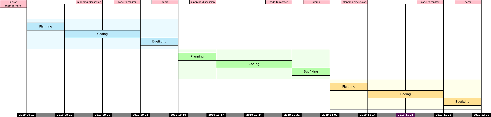

# Ütemezés

Az órák csütörtökönként a BA.F.09-ban vannak, neptun szerint 08:00-10:35 között előadás és 10:45-11:30 között gyakorlat. (Ezek aránya valamint közte a szünet az aktuális előadásanyag és az igények szerint módosulhat). A „gyakorlat” nem labor, hanem sokkal inkább konzultáció!

|hét    |dátum        |előadás|gyakorlat|
|------:|:-----------:|:-----:|:-------:|
| 1.|02.&nbsp;13.|Bevezető, áttekintés; aSpice alapok, [első feladat kiadás](sprint_1.md)|csapatsorsolás, Sprint Planning, Task Definition Workshop, Team commitment, Scheduling
| 2.|02.&nbsp;20.|Agile/Scrum | git, GitHub, IDEA ismertetés
| 3.|02.&nbsp;27!.|Napi munka, verziókezelők|Branch review, status review, standup (did, will, blocking)
| 4.|03.&nbsp;05.|Unit Testing|TDD kata
| 5.|03.&nbsp;12.|**első demo**/retrospektív, [második feladat kiadás](sprint_2.md)|Sprint planning, Task Definition Workshop, Team commitment, Scheduling
| 6.|03.&nbsp;19.|Legacy Code, SOLID|Refactoring gyakorlat egy előre előkészített példán
| 7.|03.&nbsp;26.!|Review|Random code review egy tetszőleges elfogadott pull requestből
| **8.**|**04.&nbsp;02.**|**második demo**/retrospektív, [harmadik feladat kiadás](sprint_3.md)|Sprint planning, Task Definition Workshop, Team commitment, Scheduling
| 9.|04. 09.|_Rektori/dékáni szünet_
|10.|04.&nbsp;16!.|Continous Integration|Set up a CI script running all implemented unit tests
|11.|04.&nbsp;23.|Software Architecture
|**12.**|**04.&nbsp;30.**|**harmadik demo**/retrospektív, Összefoglalás, konzultáció, tárgy feedback|Retro + Pair programming, Coding Dojo
|**13.**|**05.&nbsp;07.**|**Zárthelyi dolgozat** 08:00-tól 09:30-ig (90 perc), 1.?? és 1.?? laborok
|14.|05.&nbsp;14.|

## Gantt diagram

# Házi feladat - 1. hét

1. GitHub fiók létrehozása
    * ha még nincs
2. 11 JDK telepítése, mivel a szoftvert Java nyelven kell elkészíteni
    * ha nincs fönt
3. Fejlesztőkörnyezet telepítése és beállítása
    * IntelliJ IDEA az ajánlott és támogatott eszköz
4. Git és GitHub oktatóanyagok elolvasása
    * ha vannak hiányosságok
    * az órán nincs idő szájbarágósan git használatot oktatni, erre vannak interaktív oktatófelületek
    * ez mindenkinek egyéni felelőssége, ám ha konkrét kérdések merülnek fel, akkor ezekre természetesen kitérünk
5. Git repó klónozása
6. Kód futtatása a futtató- és a fejlesztőkörnyezet beállításainak tesztelése céljából
7. A jegyzet és az abban taglalt segédanyagok megismerése
8. Az elkészítendő szoftver átgondolása (lásd readme), statikus és dinamikus modell elkészítése komponens szinten
    * Ennek terjedelme (az órái példa alapján): egy absztrakciós szint a négyfelé bontás (kb. user story szint), és egy az ez alatti egyel, minden komponens még egy kibontása, kb. egyenrangú komponensek létrehozására - osztály szintre nem mennék le, még ha a végén ezekből akár osztály is lesz. Szóval kettő struktúra, kettő dinamikus viselkedést leíró diagram, egy magasabb és egy alacsonyabb absztrakciós szinten. Hogy konkrétan hány building block, azt mindenkinek "érzésre" kell megállapítania, ezért szubjektív az architektúra.
    * Ez egy egyéni feladat, hiszen még nincsenek csapatok. Az elkészítéshez javasolt eszközök: MS Visio, https://www.draw.io/.
    * Az elkészült diagramoknak a következő órán bemutatható állapotban kell lenniük.

# Demók

A félév során a csapatok három alkalommal prezentálják az elvégzett munkát. A „demók” az _elkészült_ szoftver megrendelőnek való bemutatását szimulálják. Nem a kódra vagyunk kíváncsiak, hanem működés közben szeretnénk látni, hogy a szoftver teljesíti feladatban foglalt követelményeket.
A bemutatás során, a `master` branchre befogadott kódot vesszük figyelembe, minden egyéb _„nem készült el határidőre”_, azaz értékelhetetlen.

# Zárthelyi

Ismert, Moodle-ös teszt, 50 kérdéssel, erre 90 perc áll majd a rendelkezésre. Minden kérdéshez 4 válaszlehetőség, amelyek közül pontosan egy a helyes. (Vannak „az alábbiak közül melyik NEM helyes” felépítésű kérdések is.) A rendelkezésre álló idő alatt kérdéseket tetszőleges alkalommal felül lehet vizsgálni, módosítani a teszt „lezárása” után azonnal kiértékelésre is kerül.
