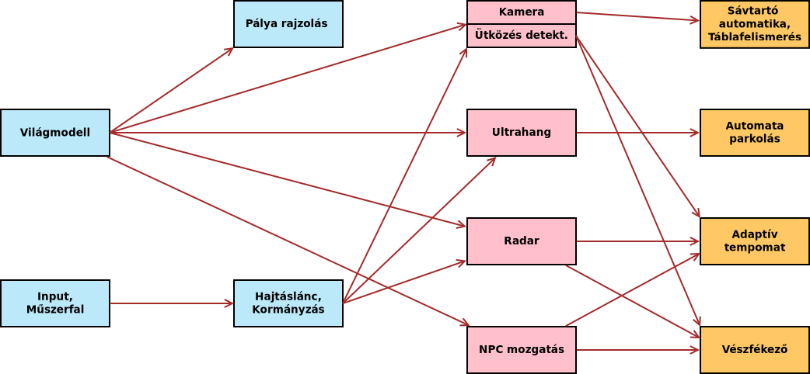

# User story-k

A félév során minden csapat 3 sprintet teljesít, minden sprintre egy-egy user story-t kap. Hat csapat esetén így a teljes elkészítendő szoftver 12 részre van bontva. A csapatok feladata a user story-k megértése, felbontása egyhuzamban elvégezhető feladatokra (task), ezekhez felelőst és határidőt rendelve.

Szintén a csapatok feladat a feladatok közötti függőségek azonosítása és az erőforrások (idő, fejlesztő) oly módon történő beosztása, hogy a határidőre minden elkészüljön. Az egyes user story-k között nem csak sprinteken átívelő függőségek lehetnek, hanem sprinten belüliek is. Ilyen esetben az érintett csapattal egyeztetve kell az egyes feladatok prioritásait meghatározni.

A user story-k függőségi gráfja alább látható, sprintenként színezve. <!--Az „Autó pozíció” nem user story, csupán az átláthatóság (kevesebb nyíl) érdekében lett berajzolva.-->

## Az egyes sprintek feladatai

- [1. sprint](sprint_1.md)
- [2. sprint](sprint_2.md)
- [3. sprint](sprint_3.md)
