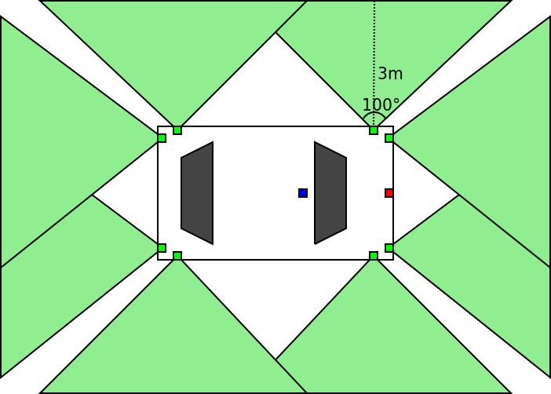
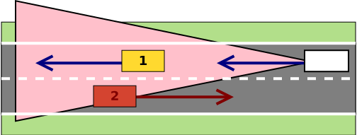
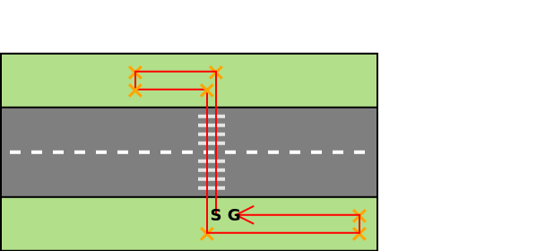

# 1. Sprint

<!-- toc -->

## Mozgatás: hajtáslánc és kormányzás

A *mozgatás* modul felelőssége a vezérelt autó (egocar) mozgatása, mozgásának számítása. Ez magába foglalja a hajtáslánc és a kormányzás megvalósítását.

A modul a HMI-től kap bemenetet, mindenek előtt váltóállás, gáz- és fékpedálállás valamint kormányelfordulás. A váltó automata, ami azzal jár, hogy a HMI a négy állapot (P, R, N, D) egyikét közli.

- **P**ark: Ez az egyik olyan állapot amiben a motor beindítható (a másik az N), ez a váltó alapállása, mechanikusan megszünteti az erőátvitelt. A valóságban nem helyettesíti kéziféket, de mivel azt nem kell implementálni a feladat során, lehet úgy tekinteni, hogy P-ben a kézifék is be van húzva. Az autó nem mozdul ebben az állásban.
- **R**everse: hátramenet
- **N**eutral: üres, ebben az állásban sem jut a motorerő tengelyekre, a motor nem gyorsíthatja az autót. Ha üresben gázt adunk, a motor felpörög, méghozzá jelentősen, mivel nincs ami ellene dolgozna. Ha az autónak volt lendülete, az még hajtja tovább.
- **D**rive: előremenet. A D-m belül definiálni kell 4-5 belső fokozatot (mint ahogy manuális váltónál is lenne), le kell programozni, hogy valamilyen fordulatszám értékeknél a váltó váltson. Ezen értékek meghatározásához lehet találni motorkarakterisztikákat (lehetőség szerint utcai autó kerüljön kiválasztásra, ne valami sportautó). A belső fokozatok a felhasználó interfész szempontjából transzparensek.

A pedál állások \[0-100\] skálán érkeznek. 0: nincs lenyomva, 1: 1%-ig van lenyomva, 100: tövig (100%-ig) le van nyomva. Minél jobban le van nyomva a gázpedál, annál több teljesítményt kell a motornak kiadnia. A motor belső működését nem kell részletekbe menően implementálni, pláne nem egy belső égésű motorét, egy elektromos hajtáslánc egyszerűbb.
A szoftverben üzemanyag-fogyasztást (vagy akkumulátor töltöttséget) és hatótávokat nem kell kezelni.

A kormány jellemzően valamilyen áttétel segítségévél befolyásolja a kormányzott kerekek helyzetét. Ez ebben a szoftverben sokkal egyszerűbb is lehet. Ha 60°-ot tengelyelfordulást feltételezünk és a kormány „nulla” állásból +/- 60-at mozdulhat el, akkor lényegében 1:1-es „áttételünk” van.
Ha az input +/- 100-as skálán adja meg a kormányelfordulás mértékét, akkor azt kell a tengelyelfordulásra képzeni. A bemeneti skálával kapcsolatban a HMI csapattal kell egyeztetni.

A úgymond kimenete egy mozgásvektor, vagyis az, hogy a következő ciklusban az autó (referenciapontjának) X, Y koordinátáit mennyivel kell módosítani.
A pedálállás és a motor korábbi állapotának függvényében meghatározásra kerül a sebesség, a kormányállás valamint az egocar korábbi orientációjának függvényében meghatározásra kerül, hogy módosul-e az autó iránya, a kettő eredőjeként a teljes vektor.

A modullal kapcsolatban kihívás a hajtáslánc működésének és a mozgás és kanyarodás fizikájának megértése, implementálása. A fizika tekintetében sem kell elaprózni a dolgokat. Két erő elégséges: a motorerő mint gyorsítja a járművet (ez a gázpedállal szabályozható) és egy fékező erő, amelyet a fékpedállal lehet szabályozni, valamint ezen felül egy konstans fékező erőnek is lennie kell, tehát a fékező erő akkor sem nulla, ha a fékpedál állása nulla. Ez utóbbit mindegy minek nevezzük (légellenállás, csúszási-súrlódási erő, a kettő eredője, stb.), nem kell cicomázni, de legyen.

Külön feladat észben tartatni és célszerűen előre felkészülni arra, hogy a 3. sprintes vezetéstámogató modulok (LKA, AAC, AEB, PP) közvetlenül az egocar hajtásláncára és a kormányra hatnak. Fel kell készíteni a modult ilyen, „nem a HMI-ről” érkező inputok kezelésére is, amelyek ráadásul magasabb prioritásúak. Pl. ha a vészfékező rendszer „lenyomja” a fékpedált, akkor magasabb prioritással kell kezelni mint a HMI-ről érkező pedálállást.


### Definition of Done

- [ ] Az autó gázpedál állásától függően gyorsul
- [ ] a fék- és gázpedál állapota a billentyű nyomva tartásának idejével szabályozható
    - [ ] fék- és gázpedál valamint a kormány sem binárisan működik, a billentyű nyomva tartás idejétől függ az input intenzitása
        - a fék- és gázpedál \[0, 100\] skálán (&#x2115;), a kormányelforgatás \[-100, 100\] skálán (&#x2124;) kerül meghatározásra
    - [ ] fék- és gázpedál valamint a kormány is fokozatosan (1 másodperc) áll vissza alaphelyzetbe a billentyű felengedésével
- [ ] az automata váltó 4 állapota szabályozható
    - szekvenciális váltóról lévén szó, sorban állíthatók a fokozatok: P(ark), R(everse), N(eutral), D(rive)
    - alaphelyzet: P, „felváltás” után R, majd N, majd D. „Leváltás” ugyanez visszafele.
- [ ] A gyorsulás a „belső fokozatok” szerint kerül meghatározásra
- [ ] Az autó a gázpedál felengedésével fokozatosan lassul, majd megáll
- [ ] Az autó R válóállásban tolat
- [ ] Felkészíteni a modult, hogy a vészfékező, az adaptív tempomat vagy a sávtartó automatika is küldhet inputot, melyek magasabb prioritásúak
    - vészfékező értelemszerűen fékezés inputot
    - az adaptív tempomat és a parkoló asszisztens gáz és fék inputot is
    - a sávtartó automatika a kormányállást módosítja
- [ ]  Autó kanyarodásának biztosítása valóságos fordulókör szerint
    - ehhez szükséges extra tulajdonságok meghatározása
- [ ] A meghatározott mozgásvektor alapján az autó pozíciójának frissítése
    - ez az AutomatedCar osztály x,y koordinátáinak frissítését jelenti
- [ ] Tolatás során is valósághű kanyarodás történik


## Szenzorok (kamera, radar), ütközés detektálás

A kamera modul felelőssége a sávtartó automatika ~~és táblafelismerő alapjául~~ szolgáló kamera szenzor implementációja. Mint minden szenzor, a kamera is érzékeli a világ egy szeletét és eléri a látóterében található objektumokat.
A valóságos és szimulált szenzorok működését részletesebben a [*Szenzorok*](../sensors.md) fejezet mutatja be.


A *radar sensor* modul felelőssége az adaptív tempomat és az automata vészfékező alapjául szolgáló radar szenzor szimulációjának implementálása. Mint minden szenzor, az radar is érzékeli a világ egy szeletét és eléri a látóterében található objektumokat.
A valóságos és szimulált szenzorok működését részletesebben a [*Szenzorok*](../sensors.md) fejezet mutatja be.


<!-- Az *ultrasonic sensor* modul felelőssége a parkoló automata alapjául szolgáló ultrahang szenzorcsomag szimulációjának implementálása. Mint minden szenzor, az ultrahang is érzékeli a világ egy szeletét és eléri a látóterében található objektumokat.
A valóságos és szimulált szenzorok működését részletesebben a [*Szenzorok*](../sensors.md) fejezet mutatja be.

A kamera és a radar szenzorhoz képest a legfőbb különbség, hogy ultrahang szenzorból 8 példány kerül az autóra.

 -->

Mindkét modul bemenete a világmodell (`World` objektum), kimeneteit olyan világ objektumok gyűjteménye képezi, amelyek beleesnek a szenzor látóterébe. A világ objektumainak lekérdezésére létre kell hozni egy publikus metódust, amely 3 pontot vár (A szenzor látóterét 3 ponttal kel definiálni.) bemenetként és visszaadja a bele eső objektumokat. Ezekből kell még leválogatni szenzoronként a relevánsakat.
Minden szenzor látóterét 3 ponttal kell definiálni. A szenzor látómezejének 3 pontját folyamatosan frissíteni kell az autó pozíciójának függvényében. Vagyis az autó egyébként folyamatosan frissülő referenciapontjához képest kell definiálni.
A megjelenítés is felhasználja ezeket a pontokat a háromszög kirajzolására a debuggoláshoz.

<!-- A táblafelismerőnek csak továbbítani kell minden látott táblát, az majd eldönti, hogy melyik miképp releváns a vezérelt autóra nézve. -->

### Alkalmazás

A sávtartó automatikának meg kell tudni határozni a sávot (ebben segítenek az útelemek részét képező sávokat reprezentáló geometria objektumok). Tehát a világmodell már jól definiált módon rendelkezésre bocsátja a sávinformációkat, de ezeket olyan adatstruktúrába kell rendezni, amely megkönnyíti a sávtartó automata implementálását: a sávtartó automatikának arra lesz majd szüksége, hogy az autó közelít-e a sávját meghatározó felfestésekhez, a sáv határait. Alternatív megközelítésben, hogy mennyire távolodik el a sávközéptől.

A kihívás a radar komponenssel kapcsolatban, hogy nem elég egyszerűen csak visszaadni a látótérben található releváns objektumokat, hanem el kell tudni dönteni, hogy a jelenlegi haladási irányunkat tartva veszélyesek-e. Pl. pontosan előttünk halad (a sávban), vagy oldalról érkezik és keresztezi az utunkat. A legközelebbi releváns objektum az alábbi ábrán az 1-es, a 2-es nem.



Itt arról van szó, hogy a a szenzor egy iterációjában megkapjuk a látótérbe került ütközhető objektumokat. Egy fa pl. jellegénél fogva statikus, tehát túlzottan sok figyelmet nem igényel, de ugyanúgy továbbítani kell mint egy autót. Az NPC autó esetében az adott iterációban ismert az autó helyzete, majd ezt össze kell vetni az előző iterációban ismert helyzetével. A kettőből meghatározható egy irányvektor és el lehet dönteni, hogy merre halad (ha halad egyáltalán), előttünk halad, vagy mellettünk (pl. másik sávban), stb. Az ACC az azonos sávban előttünk haladó autó sebességét veszi fel, ezért az autó haladási iránya fontos szempont.

Mindez értelemszerűen egy statikus objektum pl. fa esetében is működik, csak az nem mozog (mert nem Középföldén vagyunk).

### Ütközés-detektálás

Folyamatosan vizsgálni kell, hogy a vezérelt autó nekiütközött-e egy ütközhető objektumnak. Ennek vizsgálatához használható a világobjektumok poligon váza. Később majd az automatikus vészfékező modul feladat lesz, hogy ez ne következhessen be. Egy visszajelzést kell adni, amely debuggoláshoz szükséges.

### Definition of Done

**kamera**

- [ ] Elkészült 1 db, a szélvédő mögé elhelyezett kamera implementálása
- [ ] A látószög és távolság által meghatározott területen kérje el a **releváns** objektumokat
    - külön, a sávtartó szempontjából releváns objektumok, az utak
- [ ] A háromszög koordinátái az autó helyzetétől függően folyamatosan frissülnek
- [ ] A legközelebbi objektum legyen kiemelve (legyen beállítva a „highlighted” tulajdonság)

**radar**

- [ ] Elkészült 1 db, az autó első lökhárítója mögött elhelyezett radar szenzor
- [ ] A látószög (60°) és távolság (200m) által meghatározott területen kérjék el a **releváns** objektumokat
- [ ] A háromszög koordinátái az autó helyzetétől függően folyamatosan frissülnek
- [ ] Határozzák meg a legközelebbi, sávon belüli (lateral offset alapján) objektum helyzetét
- [ ] Az automata vészfékező számára releváns objektumok (az autó középvonala felé halad, látjuk) kiválogatása és visszaadása
- [ ] A legközelebbi objektum legyen kiemelve (legyen beállítva a „highlighted” tulajdonság)

<!-- **ultrahang**

- 8 db ultrahang szenzor, egyenként 3 méter látótávolsággal, 100° látószöggel
- A 8 darab háromszög koordinátái az autó helyzetétől függően folyamatosan frissülnek
- A látószög és távolság által meghatározott területen kérjék el a **releváns** objektumokat
- Határozzák meg a legközelebbi (ütközés szempontjából) objektum pozícióját, kiterjedését, távolságát
    - külön-külön minden egyes szenzor, majd a rá épülő funkcionalitás fog ezekkel tovább dolgozni, tehát célszerű biztosítani a példányonként legközelebbi objektum továbbadását -->

**ütközés-detektálás**

- [ ] A vezérelt autó - tereptárgy ütközésének detektálása és esemény kiváltása
- [ ] A vezérelt autó - NPC-vel való ütközésének detektálása és esemény kiváltása
- [ ] Két objektum akkor ütközött amikor a poligon reprezentációjuk összeért, nem amikor a képfájlok fedik egymást
    - pl. autó a fa lombkoronája alatt, de még nem érte el a törzset
- [ ] Legyen valami visszajelzés felhasználói felületen arról, hogy ütközés történt (pl. alert dialog)


## Világ benépesítése mozgó NPC objektumokkal

A modul felelőssége, hogy a kiinduló kódban rendelkezésre álló világot, amelyben már megjelennek a statikus objektumok, további dinamikus objektumokkal kell kiegészíteni. Ezek a nem játszható karakterek (NPC, _non player character_), amelyekre azért van szükség, hogy a 2. sprintes modulok tesztelhetők legyenek. Például a vészfékező rendszer nem üti el a gyalogost, vagy az adaptív tempomat igazítja az autó sebességét az előtte haladó autóéhoz.

A modul bemenete a világmodell, amely egyrészt elősegíti az implementálást azáltal, hogy a előre definiált helyett az osztályhierarchiában az NPC objektumok számára, másrészt a statikus objektumok, egészen pontosan az út elemek definiálják a pályát amelyen az NPC autónak haladnia kell a KRESZ szabályai szerint: nem tér át az út másik oldalára, nem hajt gyorsan.

A legkézenfekvőbb megoldás, hogy a világban, a világ koordinátáira építve felveszünk vezérpontokat, amelyek kijelölnek egy utat. Ezeket célszerű lehet nem a kódban, hanem valamilyen külső fájlban tárolni. Az NPC objektum pedig ezt az utat követni. Például a parkoló mellől indul az úton megy fölfele (csökken az y koordinátája) a kanyar előtt (x,y) világkoordinátákat elérve lelassul, (x,y)' koordináták elérése esetén elkezd kanyarodni, a sávból nem tér ki, majd (x,y)" koordinátáig halad a fönti egyenesen. És így tovább.




A mozgáshoz sebességet is kell társítani. Két vezérlőpont közötti egyenesen adott idő alatt kell az NPC-nek végighaladnia. Továbbá az egyes vezérlőpontokhoz forgatási műveletet is társítani kell. Ehhez egy mozgás leíró struktúra lesz szükséges, pl. az alábbi elnagyolt példa [TOML](https://toml.io/en/) nyelven, de bármilyen megoldás választható (JSON, XML, YAML vagy teljesen egyedi formátum):

```toml
[points]

[points.1]
x = 100
y = 200
rotation = 0
speed = 50 # px/s

[points.2]
x = 100
y = 100
rotation = 15
speed = 30 # px/s
```

A feladatban az igazi kihívás, hogy az NPC objektumok adaptálódjanak pályához. Az adaptálódást úgy lehet megkerülni, hogy mindkét pályához készül egy-egy útvonal. A `test_world` pályán egy gyalogos és minimum egy autó, az `oval` pályán pontosan egy, az óramutató járásával megegyező irányban haladó NPC kell, amely legyen a `car_3_black` azonosítójú.

Az NPC autónak nincs hajtáslánc modulja, nem szükséges olyan részletes mozgatás sem mint az vezérelt autónál, de azért a kanyarodás legyen több pontból/lépésben megoldva, hogy fokozatosan legyen az autó elforgatva a kanyarodás valósághű leképezése céljából.

Az `oval` pálya nagy, elnyújtott kanyarokat tartalmaz, hogy ne kelljen különösebben lassítani. A `test_world` jóval élesebb kanyarokból áll, ehhez igazítani kell az autó sebességét. Az `oval` pályán körbeérve a furgon erőteljesen, de valóságosan fékez. Nem 0 idő alatt áll meg. Legyen a lassulása 9m/s^2.

### Definition of Done:

- [ ] Objektumok előre definiált, értelmes helyen jelennek meg (autók úton, gyalogosok út mellett, a zebra környékén)
- [ ] Objektumok előre szkriptelt útvonalat követnek
- [ ] Gyalogosok az út mentén haladnak, zebrán áthaladnak, megfordulnak majd újra átkelnek az úton
- [ ] Autók az utat - sávot - pontosan követik
- [ ] NPC objektumok egymás mozgásállapotát nem változtatják meg
    - Egy NPC autó gyalogoson akár átmehet, nem kell ütközésnek minősíteni
- [ ] Legalább egy autó végigmegy a pályán a `test_world` pályán
- [ ] Legalább egy gyalogos mozog és átkel egy zebrán a `test_world` pályán, a fenti ábrának megfelelően
- [ ] Az `oval` pálya esetén az NPC objektum az óramutató járásával megegyező irányban megtesz egy kört, majd a STOP táblánál hirtelen megáll
    - [ ] nem szükséges folytatnia az útját, a másik pályán viszont folyamatosan köröz
