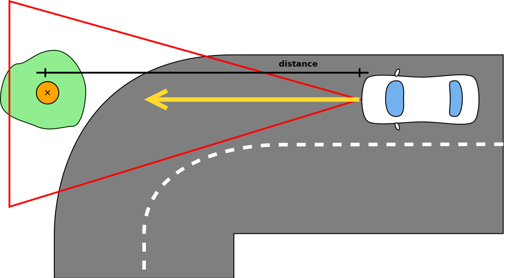

# 2. Sprint

<!-- toc -->

## Vészfékező

A modul felelőssége a radar szenzorra épülő [automata vészfékező rendszer](../functions.html#autonóm-vészfékező-rendszer-automatic-emergency-brake---aeb) megvalósítása. A vészfékező kritikus biztonsági funkció, így nem kapcsolható ki manuálisan, de maximum 70 km/h sebességig működik. A működése két esetre bontható: ütközés statikus vagy dinamikus objektummal.

Az előbbi az egyszerűbb eset, mivel a veszélyt jelentő objektum pozíciója változatlan.

El kell dönteni, hogy az autó az aktuális irányvektort figyelembe véve ütközni fog-e az objektummal. Ha igen, az autó ismert sebességét figyelembe véve kiszámolható, hogy ehhez mennyi időre van szükség és, hogy mekkora mértékű lassulás kell ehhez.

A radar visszaadja az autó előtt levő legközelebbi releváns objektum adatait (táv, sebesség), ezekkel lehet számolni. A távolságból és az autó sebességéből meghatározható, hogy milyen lassulást kell adni az autónak, hogy még megálljon, de ne lépje túl a \\( 9 m/s^2 \\)-et.

Ha az ütközés elkerülhető, vizuális figyelmeztetést kell elhelyezni a vezetőnek, hogy fékezzen. Ha nem reagál, azaz továbbra is ütközési pályán vagyunk és már csak vészfékezéssel kerülhető el az ütközés, akkor a hajtásláncnak vészfékezési inputot kell adni. Ez a maximálisan megengedett, \\( 9 m/s^2 \\)-es lassulást (ennél nagyobb lassulás veszélyes az utasokra), akkor

Ha más nem próbálgatással meg kell határozni, hogy adott sebességről egy maximális fékezési input (100% pedál állás) mennyi idő alatt fékezi állóra az autót.
A modul olyan triggerekkel vezérli az autót mint amilyenek a billentyűlenyomás kezelőtől jönnek (fékpedál állás).

Dinamikus objektumok esetében a vészfékezés elve azonos, de az ütközési pálya meghatározása összetettebb.

Másik sávban szembe jövő autóra nem kell vészfékezést kiváltani, tehát el kell tudni dönteni, hogy abban az esetben nincs ütközési pálya.

### Definition of Done

- [ ] Elkerülhető ütközés esetén vizuális figyelmeztetés a sofőrnek
- [ ] Ha a sofőr nem avatkozik közbe, automatikus fékezés (az utolsó pillanatban, ahol az ütközés még elkerülhető)
- [ ] Az automatikus fékezés mértéke a sebességgel arányos, de nem lehet \\( 9 m/s^2 \\)-nél nagyobb
- [ ] 70 km/h felett figyelmeztetés, hogy az AEB nem tud minden helyzetet kezelni
- [ ] A vezérelt autó nem üt el gyalogost, nem megy neki fának
- [ ] Nem releváns objektumok esetében (fals pozitív) mint a szembejövő autó nem történik vészfékezés

## Sávtartó automatika

A sávtartó automatika modul felelőssége a kamera szenzorra épülő [_Lane Keeping Assistant_](../functions.html#sávtartó-automatika-lane-keeping-assistant---lka) funkció megvalósítása.

Ezt két alapvetően kétféleképpen lehet megoldani. Az egyik a sáv széleihez viszonyítva korrigál: ha az autó elérné a sáv szélét, akkor ellenkormányoz. A másik megoldás kiszámolja a sáv közepét és azon tartja az autót.

### 1. Sáv széleinek használata

Itt azt lehet vizsgálni, hogy a vezérelt autó jövőbeli helyzetében metszi-e a sávot.

### 2. Sávközép használata

Itt a vezérelt autó középpontját lehet a sávközéphez igazítani.

Csak a 45 foknál enyhébb kanyarodású úton kell működnie, ilyenkor a kocsi a sáv szemmel látható közepét követi. Az LKA működése egy enyhe sávon belüli cikázást eredményez.

Az automatika számára kezelhetetlen forgalmi szituációkban (pl. éles kanyar, kereszteződés) el kell engednie a vezérlést és ezt a vezető tudtára kell hoznia. Legyen hozzá vizuális figyelmeztetés a műszerfalon (pl. LKA visszajelző sárga). Ha újra olyan útszakasz következik, ahol a funkció használható, akkor arról szintén legyen tájékoztatás.
Ezen kívül természetesen a funkció ki- és bekapcsolható.

### Definition of Done

- [ ] A sávtartó automatika ki- és bekapcsolható
    - [ ] állapota a műszerfalon látható
- [ ] Vezetői beavatkozásra kikapcsol
- [ ] 45 foknál enyhébb kanyarodású úton a kocsi a sáv szemmel láthatóan a sáv közepén marad
- [ ] Ha el kell engednie a kontrollt (az automatika számára kezelhetetlen forgalmi szituáció következik, pl. éles kanyar, kereszteződés), vizuális figyelmeztetést ad
- [ ] Ha újra elérhető a funkció (pl. elhagytuk a kanyart) vizuális indikáció (a műszerfalon)

## Adaptív tempomat

A modul felelőssége a radar szenzorra épülő [_adaptív tempomat_](../functions.html#adaptív-tempomat-adaptive-cruise-control---acc) vezetéstámogató funkció elkészítése. Ennek a funkciónak három felhasználói esetet kell lefednie.

1. Felhasználó által beállított sebesség tartása
2. A táblafelismerő által közölt sebességkorlátozás betartása
3. Az előttünk haladó (NPC) autó sebességének felvétele és egy (időben definiált) beállított követési távolság tartása
   - Valójában ettől lesz adaptív

Az egyes ponthoz szükséges kezelőszervek már elkészültek az első sprintben és a funkcióhoz szükséges bemeneti értékek már a buszon keresztül elérhetőek. A modulnak szabályoznia kell a hajtásláncot, hogy ne léphesse túl a beállított sebességet. Ehhez olyan inputot kel biztosítania mintha az a billentyűzetről érkezne, de a tényleges vezetői input felülírja őket.

A kettes pont egy harmadik sprintes (tehát aktuálisan készülő funkciótól függ), azonban könnyen visszavezethető az első pontra. A közúti szabályozást magasabb prioritásúnak kell minősíteni. Tehát a felhasználó pl. beállít egy 70 km/h-ás célsebességet, majd érkezik egy kérés a táblafelismerőtől, hogy 50km/h a megengedett, akkor azt kell figyelembe venni.

A hármas pont egy második sprintes modultól, az NPC autók meglététől függ. Az előttünk haladó sebességéhez való igazodás a legmagasabb prioritású, hiszen hiába szeretne a vezető 70-el haladni, mikor a tábla szerint 50-nel lehet, de ha az előttünk haladó mindössze 40-el halad, akkor ahhoz kell igazodni, különben nekiütközünk.
Oda kell figyelni, hogy csak a sávban előttünk haladó autót vegye figyelembe, a szembejövőt ne.

A követési _távolság_ időben történő megadása azt jelenti, hogy a beállított (pl.) 1 másodperces követés esetén akkora távolságot kell hagyni, hogy **az aktuális sebességgel** haladva 1 másodperc alatt megtett út legyen a távolság: 10 m/s (36 km/h) esetében 10 méter. Ezen érték beállítására már az első sprintben készült vezérlő.

### Definition of Done

- [ ] Ki- és bekapcsolható
- [ ] ACC: Állítható céltávolság (T jelű gombbal, körkörösen 0.8/1.0/1.2/1.4 másodperc)
- [ ] ACC: Állítható célsebesség (+/- gombbal, 30-160, 10-es lépésközzel)
- [ ] Bekapcsoláskor a célsebessége az aktuális sebesség, de a minimum célsebesség 30 km/h
- [ ] Ha nincs saját sávban előttünk autó, akkor a vezérelt autó tartja a kiválasztott célsebességet
- Ha a saját sávban található autó:
  - [ ] Ha az előttünk levő autó lassabb, akkor fel kell venni a sebességét
  - [ ] Ha gyorsabb, akkor tartja a kiválasztott sebességet
- [ ] Fékezésre kikapcsol
- [ ] AEB beavatkozásra kikapcsol
<!-- - [ ] Ha sebesség korlátozást talál a buszon, azt alkalmazza új célsebességként, amíg a sofőr felül nem írja -->
