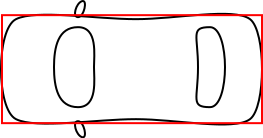
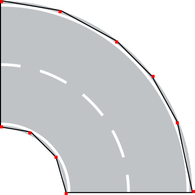

# Virtuális világ

Az autónak egy virtuális tesztpályán kell végigmennie, amelyhez modellezni a világot. Két teszt pályát biztosítunk, egy egyszerűbbet és egy nagyobbat, bonyolultabbat. Alább látható az egyszerűbb.


A fenti világ elemekből épül föl, amelyek között vannak egyenes útszakaszok, kanyarok (pl. 45° és 90°), T elágazás, gyalogos átkelő, közúti táblák, parkolók és fák. Mindezt [egy XML](resources/test_world.xml), vagy [egy JSON](resources/test_world.json) írja le. A feladat megoldásához bármelyik formátum használható.

A számítógépes grafikában megszokott módon, a bal felső sarok jelenti az origót (0,0) koordinátát. Az x tengely tehát jobbra haladva, az y tengely lefelé haladva növekszik. Így kell értelmezni az XML-t és ekképpen működik a megjelenítés is, hiszen a form bal felső sarkánál van a (0, 0) pont. Az alábbi kép [forrása](http://www.e-cartouche.ch/content_reg/cartouche/graphics/en/html/Screen_learningObject3.html).


## Objektumok leírása

Egy-egy objektum leírása a következőképpen néz ki (XML-ben):

``` xml
<Object type="road_2lane_straight">
      <Position x="1700" y="144"/>
      <Transform m11="0" m12="1" m21="-1" m22="0"/>
      <Parameter name="roadpainting_1" value="1"/>
      <Parameter name="roadpainting_2" value="1"/>
      <Parameter name="roadpainting_3" value="1"/>
</Object>
```

* A `type` attribútum írja le, hogy milyen objektumról van szó. A példában egy 2 sávos egyenes útszakaszról.
* A `Position` elem megadja az elem viszonyítási pontjának koordinátáját.
* A `Transform` elem egy 2×2-es transzformációs mátrix, amely forgatást ír le.
* A `roadpainting` megadná, hogy milyen felfestések vannak vannak az úton, de ez nem releváns
* Egy ilyen egyenes útelem 350×350px, ekkora a kép is és ennek kell lennie az XML-ben is.

## Az út elemek viszonyítási pontjai

A képfájlok amikkel a rajzoló csapat dolgozik elég sajátosan működnek. A transzformációs mátrixban leírt elforgatás pl. nem a bal felső sarokkal van értelmezve, hanem elemenként más és más ponttal. Ezek rögzítése szükséges lehet a modellben, a rajzoló csapat munkáját megkönnyítendő. Egyébként korábbi félévekben ezt már összeszedték [egzakt módon is](resources/reference_points.xml).

 

 

 


Minden itt fel nem sorolt esetben feltételezhető, hogy a bal felső sarok a viszonyítási pont.

Egy korábbi félév során a referenciapontokat (részben) már összegyűjtötték (@csabalint, @SiposGergo, @markkurucz), ez elérhető [XML](resources/reference_points.xml) vagy [JSON](resources/reference_points.json) formátumban.

A mozgatásra szoruló elemek (vezérelt autó és NPC autók) nem képezik részét a világ leírásának, viszonyítási pontjuk nem definiált. A rendelkezésre bocsátott autó képek méretarányosak az összes többi objektummal.

A világhoz szükséges elemek megtalálhatóak a kiinduló project `src/main/resources` (Java) vagy `src/AutomatedCat/Assets` (C#) mappájában.

## Objektum poligonok

Minden objektumnak kell, hogy legyen egy poligon váza, amely többek között az ütközéshez vagy a kijelüléshez is használható. Különböző objektumoknak azonban kicsit mást jelent ez a poligon „váz”.

Az autó esetében (pl.) a legfontosabb felhasználása az, hogy nekiment-e valaminek, tehát az autó körvonalát kell megjelölni. Ez leegyszerűsíthető, nem kell a grafikai elemet teljes mértékben követni.



Egyes elemek (fa, tábla) a felülnézet miatt nem azt mutatják, ami az ütközéshez szükséges. Értelem szerűen nem a lombkoronának, hanem a törzsnek lehet nekiütközni. Tehát egy törzset kell ábrázolni a poligonnal.


Az útelemek esetében nem az ütközés a probléma, hanem a sávokat kell kijelölni, amit a a sávtartó automatika fog felhasználni. Ezeket is lehet egyszerűsíteni.



A poligonok megrajzolásához használható a [VGG Image Annotator](https://www.robots.ox.ac.uk/~vgg/software/via/), amely [böngészőből is működik](https://www.robots.ox.ac.uk/~vgg/software/via/via.html) és a megrajzolt polygont JSON-ben le lehet menteni.

Korábbi félév során @ArchiCat és @konyarilaszlo ezt már megtette, elérhető a [worldobject_polygons.json](resources/worldobject_polygons.json) állományban.

Ennek struktúrája:

```json
{
    "objects": [
        {
            "typename": "car_1_white",
            "polys": [
            {
                "type": "standalone",
                "points": [
                [51, 239],
                [40, 238],
                [26, 236],
                ...
                [51, 239]
                ]
            }
            ]
        },
        ...
    ]
}
```

Van benne egy objects tömb, minden objektum esetében a `typename` a képfájl neve (kiterjesztés nélkül), majd egy polygon tömb (mivel a [VGG Image Annotator](https://www.robots.ox.ac.uk/~vgg/software/via/) multipoligonokat is elő tud állítani). Azon belül egy `points` tömb ahol a koordináták a képfájlon koordinátarendszerében értendők.


A fenti példa esetében a képfájl (50, 20) koordinátára van rajzolva, a hatszög benne a képen belüli relatív koordinátákkal van megadva.

```json
"points": [
    [10, 10],
    [15, 8],
    [20, 10],
    [20, 20],
    [15, 22],
    [10, 20],
    [10, 10]
]
```


## Méretarány

Az XML-ben leírt objektumok koordináta-rendszere nem feltétlenül egyezik meg a megjelenítő koordináta-rendszerével, ezt figyelembe véve skálázás, vagy viewport kezelés válhat szükségessé.

A feladat megoldás során jellemzően valóságos mértékegységekben specifikáljuk a feladatot (pl. méter, km/h, m/s^2, stb.) míg az XML és a grafikai elemek értelem szerűen pixellel dolgoznak. Ennek feloldására, illetve az átváltásra az **1m=50px** szabályt célszerű használni. Ez egy hozzávetőlegesen arányos érték, amellyel számolni is könnyű.

<!--## Sávtartó automatika tesztelése

A sávtartó automatika nem tesztelhető kanyarokban, ehhez ezért egy alább látható kinézetű pályaszakasz készült. Csak 6°-os és egyenes útszakaszból áll. [Az XML elérhető itt](resources/lane_keeping_test_world.xml).


-->